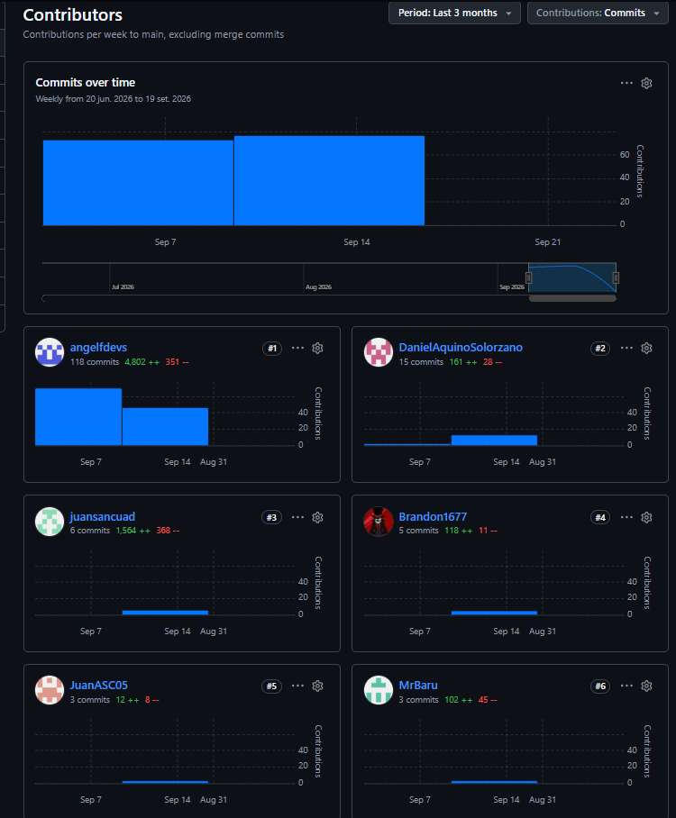
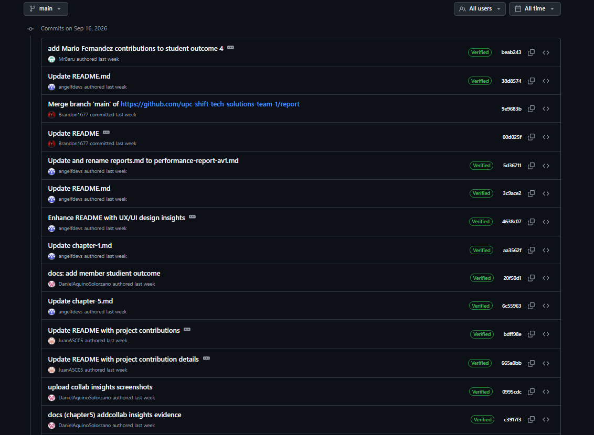
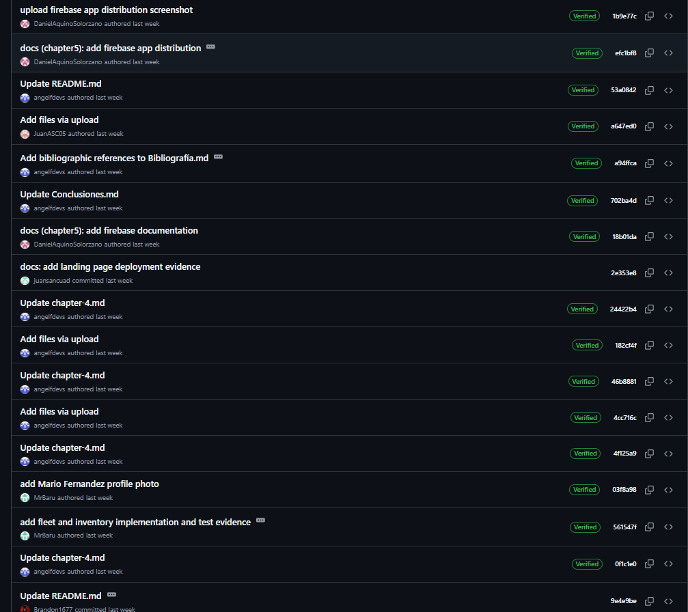

 

  

 

<h1 align="center">Universidad Peruana de Ciencias Aplicadas</h1>
<h2 align="center">Carrera de Ingenieria de Software</h2>

<h4 align="center">Curso</h4>
<h3 align="center"><strong>Diseño de Experimentos de Ingenieria de Software - 1ASI0732</strong></h3>
<h4 align="center">NRC</h4>
<h3 align="center"><strong>9100</strong></h3>
<h4 align="center">Docente</h4>
<h3 align="center"><strong>Sanchez Ponce, Alex Humberto</strong></h3>
<h3 align="center"><strong>Informe de Trabajo Final</strong></h3>
<h4 align="center">Equipo</h4>
<h3 align="center"><strong>ShiftTech Solutions</strong></h3>
<h4 align="center">Proyecto</h4>
<h3 align="center"><strong>AutoService</strong></h3>

 

  

AutoService es una aplicacion web orientada a mejorar la eficiencia de talleres pequenos y aumentar la transparencia del servicio para el propietario del vehiculo.

<h3 align="center"><strong>Integrantes:</strong></h3>

  <table align="center">
    <thead>
      <tr>
        <th align="center">Codigo</th>
        <th align="center">Nombre</th>
      </tr>
    </thead>
    <tbody>
      <tr>
        <td align="center">U20231B781</td>
        <td align="center">Flores Eusebio, Angel Thyago</td>
      </tr>
      <tr>
        <td align="center">U202217678</td>
        <td align="center">Aquino Solorzano, Daniel Jonatan</td>
      </tr>
      <tr>
        <td align="center">U202315640</td>
        <td align="center">Soto Palacios, Brandon Wilder</td>
      </tr>
      <tr>
        <td align="center">U202319404</td>
        <td align="center">Sanchez Cuadrado, Juan Antonio</td>
      </tr>
      <tr>
        <td align="center">U202317807</td>
        <td align="center">Fernández, Mario Alonso</td>
      </tr>
      <tr>
        <td align="center"></td>
        <td align="center"></td>
      </tr>
    </tbody>
  </table>

<h3 align="center"><strong>Periodo 202620</strong></h3>
<h3 align="center"><strong>Septiembre 2026</strong></h3>

# Registro de Versiones del informe

| Versión | Fecha | Autor | Descripción de la modificación |
|---|---|---|---|
| 1 | 16/09/26 | Sanchez Cuadrado, Juan Antonio | **AV1:** Documentación de los capítulos del informe, integración de la aplicación móvil, configuración de despliegues y elaboración de evidencias técnicas del proyecto AutoService. |
| 1 | 16/09/26 | Flores Eusebio, Angel Thyago | **AV1:** |
| 1 | 16/09/26 | Soto Palacios, Brandon Wilder | **AV1:** |
| 1 | 16/09/26 | Aquino Solorzano, Daniel Jonatan | **AV1:** |
| 1 | 16/09/26 | Fernández, Mario Alonso | **AV1:** |

# Project Report Collaboration Insights

El informe del proyecto AutoService se desarrolla de manera colaborativa mediante GitHub, utilizando control de versiones para mantener la trazabilidad de los cambios realizados por los integrantes del equipo.

**Project Report Repository:**

https://github.com/upc-shift-tech-solutions-team-1/report

## AV1

Durante el AV1, el equipo utilizó el repositorio público del Project Report para trabajar de manera colaborativa sobre la documentación de AutoService. El historial de Git permitió mantener trazabilidad sobre las modificaciones realizadas y evidenciar la participación de los integrantes durante la elaboración y actualización de los capítulos del informe.

### Contributors

La siguiente evidencia corresponde a los analíticos de contribución del repositorio del informe durante el desarrollo del AV1.

Los analíticos permiten observar la participación de los integrantes mediante contribuciones realizadas al repositorio. Esta evidencia complementa el Registro de Versiones del Informe y permite verificar que la documentación fue desarrollada de manera colaborativa.

### Commit History

La siguiente evidencia muestra parte del historial de commits realizados sobre el repositorio del Project Report durante el AV1.

Asimismo, se conserva una segunda evidencia del historial con el objetivo de mostrar una mayor parte de las modificaciones registradas durante la entrega.

El historial permite identificar los autores, mensajes de commit y modificaciones incorporadas durante el desarrollo del informe. El uso de Git y GitHub permitió mantener trazabilidad de los cambios y conservar evidencia de la colaboración del equipo durante el AV1.

## Trabajo Parcial

> PENDIENTE: incorporar al finalizar el Trabajo Parcial las evidencias actualizadas de colaboración, commits, branches y Pull Requests realizados durante esta entrega.

# Contenido

- [Registro de Versiones del informe](#registro-de-versiones-del-informe)
- [Project Report Collaboration Insights](#project-report-collaboration-insights)
- [Student Outcome](#student-outcome)

- [Part I: As-Is Software Project](./markdown/content/chapter-1.md)

  - [Capítulo I: Introducción](./markdown/content/chapter-1.md)
    - [1.1. Startup Profile](./markdown/content/chapter-1.md#11-startup-profile)
      - [1.1.1. Descripción de la Startup](./markdown/content/chapter-1.md#111-descripción-de-la-startup)
      - [1.1.2. Perfiles de integrantes del equipo](./markdown/content/chapter-1.md#112-perfiles-de-integrantes-del-equipo)
    - [1.2. Solution Profile](./markdown/content/chapter-1.md#12-solution-profile)
      - [1.2.1. Antecedentes y problemática](./markdown/content/chapter-1.md#121-antecedentes-y-problemática)
      - [1.2.2. Lean UX Process](./markdown/content/chapter-1.md#122-lean-ux-process)
        - [1.2.2.1. Lean UX Problem Statements](./markdown/content/chapter-1.md#1221-lean-ux-problem-statements)
        - [1.2.2.2. Lean UX Assumptions](./markdown/content/chapter-1.md#1222-lean-ux-assumptions)
        - [1.2.2.3. Lean UX Hypothesis Statements](./markdown/content/chapter-1.md#1223-lean-ux-hypothesis-statements)
        - [1.2.2.4. Lean UX Canvas](./markdown/content/chapter-1.md#1224-lean-ux-canvas)
    - [1.3. Segmentos objetivo](./markdown/content/chapter-1.md#13-segmentos-objetivo)

  - [Capítulo II: Requirements Elicitation & Analysis](./markdown/content/chapter-2.md)
    - [2.1. Competidores](./markdown/content/chapter-2.md#21-competidores)
      - [2.1.1. Análisis competitivo](./markdown/content/chapter-2.md#211-análisis-competitivo)
      - [2.1.2. Estrategias y tácticas frente a competidores](./markdown/content/chapter-2.md#212-estrategias-y-tácticas-frente-a-competidores)
    - [2.2. Entrevistas](./markdown/content/chapter-2.md#22-entrevistas)
      - [2.2.1. Diseño de entrevistas](./markdown/content/chapter-2.md#221-diseño-de-entrevistas)
      - [2.2.2. Registro de entrevistas](./markdown/content/chapter-2.md#222-registro-de-entrevistas)
      - [2.2.3. Análisis de entrevistas](./markdown/content/chapter-2.md#223-análisis-de-entrevistas)
    - [2.3. Needfinding](./markdown/content/chapter-2.md#23-needfinding)
      - [2.3.1. User Personas](./markdown/content/chapter-2.md#231-user-personas)
      - [2.3.2. User Task Matrix](./markdown/content/chapter-2.md#232-user-task-matrix)
      - [2.3.3. User Journey Mapping](./markdown/content/chapter-2.md#233-user-journey-mapping)
      - [2.3.4. Empathy Mapping](./markdown/content/chapter-2.md#234-empathy-mapping)
      - [2.3.5. As-is Scenario Mapping](./markdown/content/chapter-2.md#235-as-is-scenario-mapping)
    - [2.4. Ubiquitous Language](./markdown/content/chapter-2.md#24-ubiquitous-language)

  - [Capítulo III: Requirements Specification](./markdown/content/chapter-3.md)
    - [3.1. To-Be Scenario Mapping](./markdown/content/chapter-3.md#31-to-be-scenario-mapping)
    - [3.2. User Stories](./markdown/content/chapter-3.md#32-user-stories)
    - [3.3. Product Backlog](./markdown/content/chapter-3.md#33-product-backlog)
    - [3.4. Impact Mapping](./markdown/content/chapter-3.md#34-impact-mapping)

  - [Capítulo IV: Product Design](./markdown/content/chapter-4.md)
    - [4.1. Style Guidelines](./markdown/content/chapter-4.md#41-style-guidelines)
      - [4.1.1. General Style Guidelines](./markdown/content/chapter-4.md#411-general-style-guidelines)
      - [4.1.2. Web Style Guidelines](./markdown/content/chapter-4.md#412-web-style-guidelines)
      - [4.1.3. Mobile Style Guidelines](./markdown/content/chapter-4.md#413-mobile-style-guidelines)
    - [4.2. Information Architecture](./markdown/content/chapter-4.md#42-information-architecture)
    - [4.3. Landing Page UI Design](./markdown/content/chapter-4.md#43-landing-page-ui-design)
    - [4.4. Mobile Applications UX/UI Design](./markdown/content/chapter-4.md#44-mobile-applications-uxui-design)
    - [4.5. Mobile Applications Prototyping](./markdown/content/chapter-4.md#45-mobile-applications-prototyping)
    - [4.6. Web Applications UX/UI Design](./markdown/content/chapter-4.md#46-web-applications-uxui-design)
    - [4.7. Web Applications Prototyping](./markdown/content/chapter-4.md#47-web-applications-prototyping)
    - [4.8. Domain-Driven Software Architecture](./markdown/content/chapter-4.md#48-domain-driven-software-architecture)
    - [4.9. Software Object-Oriented Design](./markdown/content/chapter-4.md#49-software-object-oriented-design)
    - [4.10. Database Design](./markdown/content/chapter-4.md#410-database-design)

  - [Capítulo V: Product Implementation](./markdown/content/chapter-5.md)
    - [5.1. Software Configuration Management](./markdown/content/chapter-5.md#51-software-configuration-management)
      - [5.1.1. Software Development Environment Configuration](./markdown/content/chapter-5.md#511-software-development-environment-configuration)
      - [5.1.2. Source Code Management](./markdown/content/chapter-5.md#512-source-code-management)
      - [5.1.3. Source Code Style Guide & Conventions](./markdown/content/chapter-5.md#513-source-code-style-guide--conventions)
      - [5.1.4. Software Deployment Configuration](./markdown/content/chapter-5.md#514-software-deployment-configuration)
    - [5.2. Product Implementation & Deployment](./markdown/content/chapter-5.md#52-product-implementation--deployment)
      - [5.2.1. Sprint Backlogs](./markdown/content/chapter-5.md#521-sprint-backlogs)
      - [5.2.2. Implemented Landing Page Evidence](./markdown/content/chapter-5.md#522-implemented-landing-page-evidence)
      - [5.2.3. Implemented Frontend-Web Application Evidence](./markdown/content/chapter-5.md#523-implemented-frontend-web-application-evidence)
      - [5.2.4. Acuerdo de Servicio - SaaS](./markdown/content/chapter-5.md#524-acuerdo-de-servicio---saas)
      - [5.2.5. Implemented Native-Mobile Application Evidence](./markdown/content/chapter-5.md#525-implemented-native-mobile-application-evidence)
      - [5.2.6. Implemented RESTful API and/or Serverless Backend Evidence](./markdown/content/chapter-5.md#526-implemented-restful-api-andor-serverless-backend-evidence)
      - [5.2.7. RESTful API Documentation](./markdown/content/chapter-5.md#527-restful-api-documentation)
      - [5.2.8. Team Collaboration Insights](./markdown/content/chapter-5.md#528-team-collaboration-insights)
    - [5.3. Video About-the-Product](./markdown/content/chapter-5.md#53-video-about-the-product)

- [Part II: Verification, Validation & Pipeline](./markdown/content/chapter-6.md)

  - [Capítulo VI: Product Verification & Validation](./markdown/content/chapter-6.md)
    - [6.1. Testing Suites & Validation](./markdown/content/chapter-6.md#61-testing-suites--validation)
      - [6.1.1. Core Entities Unit Tests](./markdown/content/chapter-6.md#611-core-entities-unit-tests)
      - [6.1.2. Core Integration Tests](./markdown/content/chapter-6.md#612-core-integration-tests)
      - [6.1.3. Core Behavior-Driven Development](./markdown/content/chapter-6.md#613-core-behavior-driven-development)
      - [6.1.4. Core System Tests](./markdown/content/chapter-6.md#614-core-system-tests)

  - [Capítulo VII: DevOps Practices](./markdown/content/chapter-7.md)
    - [7.1. Continuous Integration](./markdown/content/chapter-7.md#71-continuous-integration)
      - [7.1.1. Tools and Practices](./markdown/content/chapter-7.md#711-tools-and-practices)
      - [7.1.2. Build & Test Suite Pipeline Components](./markdown/content/chapter-7.md#712-build--test-suite-pipeline-components)
    - [7.2. Continuous Delivery](./markdown/content/chapter-7.md#72-continuous-delivery)
      - [7.2.1. Tools and Practices](./markdown/content/chapter-7.md#721-tools-and-practices)
      - [7.2.2. Stages Deployment Pipeline Components](./markdown/content/chapter-7.md#722-stages-deployment-pipeline-components)
    - [7.3. Continuous Deployment](./markdown/content/chapter-7.md#73-continuous-deployment)
      - [7.3.1. Tools and Practices](./markdown/content/chapter-7.md#731-tools-and-practices)
      - [7.3.2. Production Deployment Pipeline Components](./markdown/content/chapter-7.md#732-production-deployment-pipeline-components)

- [Conclusiones](./markdown/content/Conclusiones.md)
- [Bibliografía](./markdown/content/Bibliografía.md)
- [Anexos](./markdown/content/Anexos.md)

# Student Outcome

El presente apartado evidencia el cumplimiento del ABET – EAC - Student Outcome 4: <b>La capacidad de reconocer responsabilidades éticas y profesionales en situaciones de ingeniería y hacer juicios informados, que deben considerar el impacto de las soluciones de ingeniería en contextos globales, económicos, ambientales y sociales.</b>

- <b>AV1</b>: Documentacion desde el capitulo del 1 al 5, despliegue de aplicacion web y movil.

<table>
    <tr>
        <td align="center"><b>Criterio específico</b></td>
        <td align="center"><b>Acciones realizadas</b></td>
        <td align="center"><b>Conclusiones</b></td>
    </tr>
    <tr>
        <td rowspan="5">
            <b>4.c.1. Reconoce responsabilidad ética y profesional en situaciones de ingeniería de software</b>
        </td>
        <td>
            <b>Aquino Solorzano, Daniel Jonatan</b> 
            <i>AV1</i>
            
Durante el ciclo de desarrollo de AutoService, ejercí la responsabilidad ética y el rigor profesional en múltiples etapas críticas: gestioné el consentimiento informado y la privacidad de los participantes al realizar las entrevistas del segmento Vehicle Owners, garantizando una recolección íntegra de requerimientos sin sesgos intencionales; mantuve la transparencia y autoría técnica veraz del equipo al consolidar y subir los GitHub Collaboration Insights; aseguré la integridad en la entrega de software al configurar el despliegue restringido de los artefactos .apk mediante Firebase App Distribution solo a verificadores autorizados, evitando la exposición de versiones inestables; y apliqué estándares de calidad, mantenibilidad y desacoplamiento arquitectónico al modelar e implementar el Bounded Context "Mechanic" en la aplicación móvil, cumpliendo con el compromiso deontológico de entregar una solución técnica robusta, segura y alineada a las necesidades reales del dominio.

        </td>
        <td rowspan="5">
            <i>AV1</i>
            
El AV1 permitió al equipo reconocer que desarrollar AutoService exige más que construir interfaces y funcionalidades. La definición del modelo de negocio, el análisis de necesidades, la refinación de requisitos y el diseño de las experiencias web y móvil hicieron necesario considerar la privacidad de la información, los permisos de cada rol y la claridad de los procesos. Asimismo, el equipo identificó su responsabilidad de documentar con transparencia las decisiones tomadas y distinguir los prototipos de las funciones efectivamente implementadas. Estas prácticas constituyen una base para continuar el desarrollo y la validación del producto de manera profesional.

        </td>
    </tr>
    <tr>
        <td>
            <b>Flores Eusebio, Angel Thyago</b> 
            <i>AV1</i>
            
La refinación de los requisitos, el diseño UX/UI en Figma y el desarrollo de Workshop y Staff me permitieron reconocer que una interfaz funcional también debe ser clara y respetar las responsabilidades de cada rol. Durante el trabajo procuré mantener coherencia entre las User Stories, los prototipos y el frontend móvil, diferenciando las funcionalidades implementadas de las que aún dependen del backend. Esto reforzó la importancia de comunicar con transparencia el estado real del producto y de considerar el acceso adecuado a la información del taller.

        </td>
    </tr>
    <tr>
        <td>
            <b>Soto Palacios, Brandon Wilder</b> 
            <i>AV1</i>
            
En este primer avance del proyecto AutoService, contribuí en las bases principales del proyecto, además a travez de valores como respeto, integridad, seguridad y empatía realicé las entrevistas del segmento numero uno, de los mecánicos independientes. Posteriormente elaboré las correctar descripciones acorde al formato establecido, y sus adecuados análisis que recopilan información importante para el proyecto. Asimismo contribuí con la realización de módulos de customer management y customer trust del apartado de aplicación móvil, tod con los lineamientos establecidos por el equipo y el curso presente.

        </td>
    </tr>
    <tr>
        <td>
            <b>Sanchez Cuadrado, Juan Antonio</b> 
            <i>AV1</i>
            
Participé en la elaboración y revisión de la documentación técnica del proyecto AutoService desde los capítulos 1 al 5, procurando mantener coherencia entre los requerimientos, el diseño, la implementación y las evidencias presentadas. Asimismo, participé en la integración y configuración de los productos del proyecto, incluyendo la aplicación Web, la aplicación móvil, la RESTful API y los servicios de despliegue. Durante este proceso consideré prácticas profesionales como el uso responsable del control de versiones, la protección de credenciales mediante variables de entorno, la validación de los cambios antes de integrarlos y la documentación transparente de funcionalidades implementadas y pendientes.

        </td>
    </tr>
    <tr>
        <td>
            <b>Fernandez Seer, Mario Alonso</b> 
            <i>AV1</i>
            
Participé en la implementación de los módulos Fleet Management e Inventory Management de la aplicación Android. Incorporé 22 pruebas unitarias y comprobé los flujos de registro y edición de vehículos, creación de productos y recepción de existencias en modo demo. Como parte de mi responsabilidad profesional, distinguí los resultados obtenidos con datos de demostración de la integración real con el servidor, que quedó pendiente de validación. Esto permite presentar evidencias verificables y comunicar las limitaciones del avance sin atribuir resultados a pruebas que todavía no se han realizado.

        </td>
    </tr>
    <tr>
        <td rowspan="5">
            <b>4.c.2. Emite juicios informados considerando el impacto de las soluciones de ingeniería de software en contextos globales, económicos, ambientales y sociales</b>
        </td>
        <td>
            <b>Aquino Solorzano, Daniel Jonatan</b> 
            <i>AV1</i>
            
A través del diseño de soluciones centrado en el usuario y la modelación técnica, evalué y sinteticé el impacto integral de AutoService en diversas dimensiones: en el ámbito social y de usabilidad, el mapeo de escenarios As-Is y To-Be junto con la grabación del prototipo interactivo en Figma permitieron mitigar la asimetría de información y la desconfianza habitual entre conductores y talleres mediante interfaces claras y accesibles; a nivel económico, la implementación del Bounded Context "Mechanic" en la app móvil optimiza la productividad operativa de los mecánicos, agiliza la gestión de órdenes de trabajo y previene pérdidas por diagnósticos ineficientes; y en los contextos ambiental y global, promover el mantenimiento preventivo oportuno mediante una plataforma digital ayuda a extender la vida útil de los vehículos, reduciendo las emisiones contaminantes generadas por fallas mecánicas desatendidas y eliminando el consumo innecesario de papel en la administración tradicional de los talleres.

        </td>
        <td rowspan="5">
            <i>AV1</i>
            
El análisis de los segmentos, las User Stories y los flujos de AutoService permitió valorar el impacto potencial de la solución en administradores, mecánicos y clientes beneficiarios. Una mejor organización de órdenes, tareas y personal podría contribuir a reducir reprocesos, aprovechar mejor los recursos del taller y ofrecer mayor transparencia sobre los servicios. Al mismo tiempo, el equipo reconoció la importancia de diseñar experiencias accesibles para personas con distintos niveles de familiaridad digital y de adaptar la solución a diferentes contextos de uso. Estos beneficios económicos, sociales y ambientales son proyecciones del AV1, no resultados medidos; deberán contrastarse mediante pruebas y validaciones posteriores.

        </td>
    </tr>
    <tr>
        <td>
            <b>Flores Eusebio, Angel Thyago</b> 
            <i>AV1</i>
            
Al diseñar los flujos móviles y desarrollar las funciones de órdenes, tareas y personal técnico, analicé cómo AutoService podría mejorar la coordinación del taller y la visibilidad del trabajo realizado. Una gestión más ordenada tiene el potencial de reducir reprocesos y favorecer la atención al cliente, con posibles beneficios económicos y un uso más eficiente de recursos. También consideré que la solución debe ser comprensible para usuarios con distintos niveles de experiencia digital. Estos impactos son potenciales y deberán comprobarse mediante validaciones con usuarios.

        </td>
    </tr>
    <tr>
        <td>
            <b>Soto Palacios, Brandon Wilder</b> 
            <i>AV1</i>
            
Para esta primera entrega del desarrollo de AutoService, se respeto el trabajo con lineamientos adecuados, esto incluye la realización y comunicación asertiva con el equipo de trabajo, con lo que conllevo la realización de los capítulos uno y dos del avance del reporte oficial. Además con las consignas claras se llevó a desarrollar las versiones preliminares de landing page, backend y frontend, posteriormente el desarrollo de la aplicación móvil inspirada en los trabajos previos y los objetivos establecidos. Conluyo este primer avance con satisfactoria realización y adecuada ejecución de labores.

        </td>
    </tr>
    <tr>
        <td>
            <b>Sanchez Cuadrado, Juan Antonio</b> 
            <i>AV1</i>
            
Durante el desarrollo de AutoService participé en decisiones relacionadas con la integración y despliegue de la solución, evaluando alternativas para la aplicación Web, la RESTful API, la base de datos y la aplicación móvil. Se consideraron aspectos como disponibilidad, costo de los servicios cloud, facilidad de mantenimiento, seguridad de la información y accesibilidad para los usuarios. También se buscó que la solución permita digitalizar procesos habituales de los talleres automotrices, reduciendo la dependencia de registros manuales y facilitando el acceso centralizado a información de clientes, vehículos, órdenes de trabajo, mecánicos e inventario.

        </td>
    </tr>
    <tr>
        <td>
            <b>Fernandez Seer, Mario Alonso</b> 
            <i>AV1</i>
            
Durante la implementación de Fleet e Inventory consideré la importancia de validar los datos de vehículos y productos, mostrar las existencias disponibles y calcular precios y márgenes de forma consistente. Estas funciones pueden apoyar decisiones de compra y reducir errores en la gestión del taller. Desde una perspectiva social, la claridad de la información puede facilitar el trabajo del personal y la atención al cliente; desde una perspectiva ambiental, un mejor control del inventario podría ayudar a evitar compras innecesarias y desperdicios. Estos beneficios son potenciales y requieren validación con usuarios y datos reales. También incorporé textos en español e inglés para facilitar la adaptación de la interfaz a distintos usuarios.

        </td>
    </tr>
</table>
