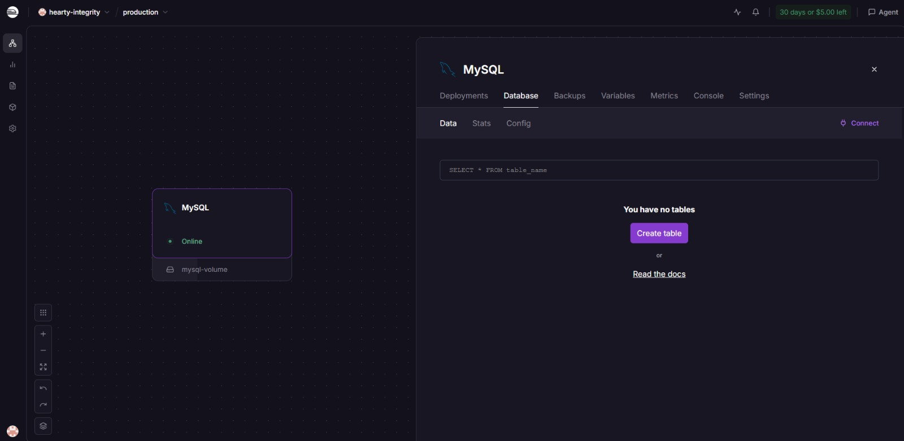
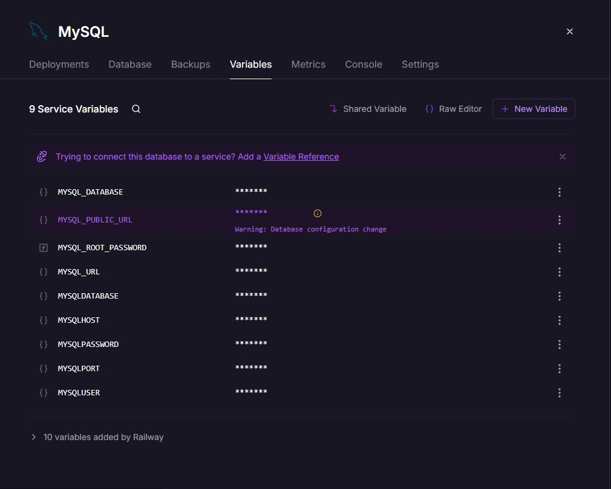
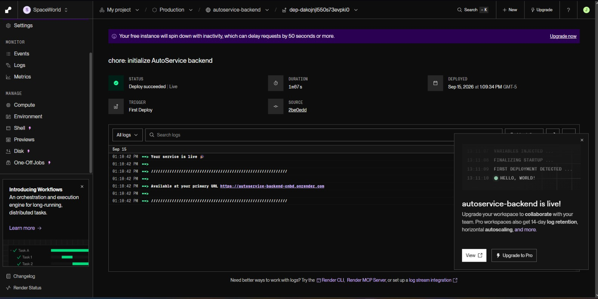
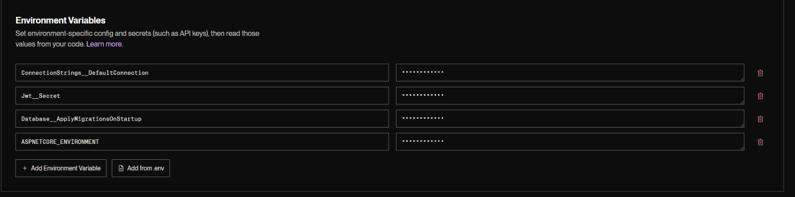
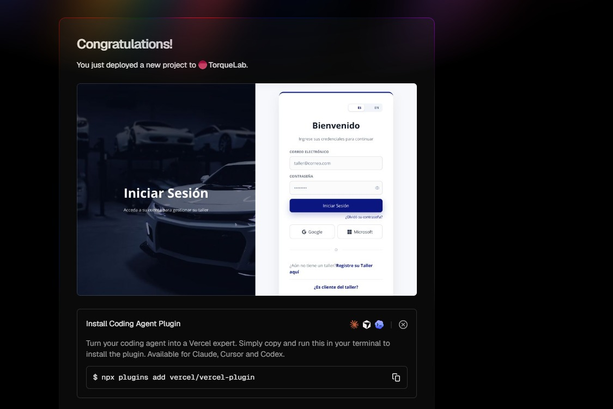
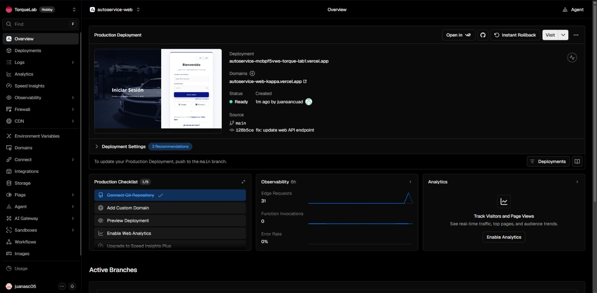
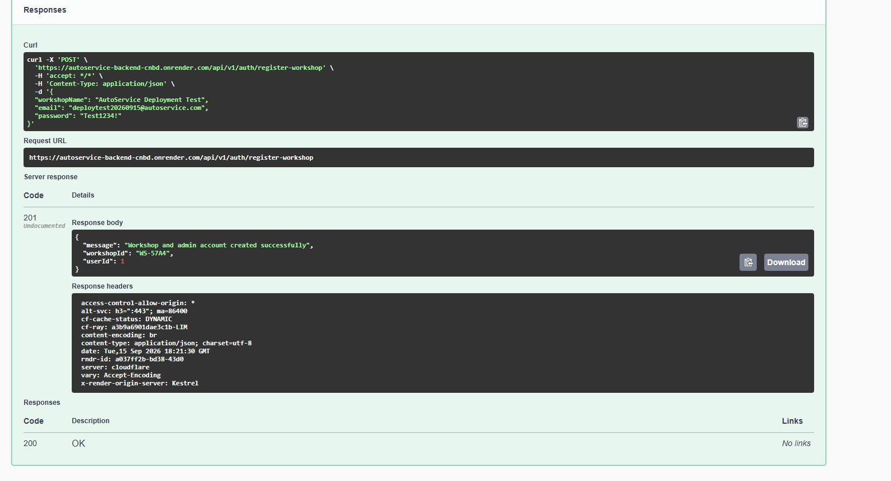
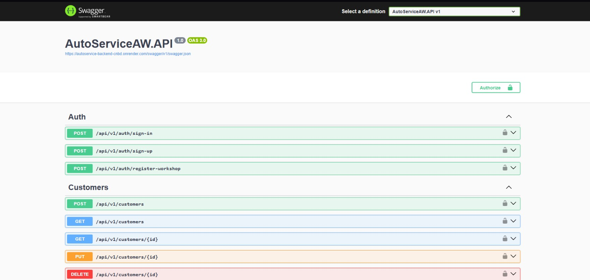

 

  

 

# 5.1. Software Configuration Management

La gestión de configuración de software de AutoService comprende las decisiones, herramientas y convenciones utilizadas por el equipo para mantener la consistencia de los productos digitales durante su ciclo de vida.

La solución está conformada por una Landing Page, una Web Application, una Native Mobile Application, una RESTful API y una base de datos relacional. Debido a ello, se utilizan diferentes tecnologías y herramientas para actividades de gestión del proyecto, diseño UX/UI, desarrollo, documentación, control de versiones, pruebas y deployment.

Las siguientes secciones describen el entorno de desarrollo utilizado por el equipo, la estrategia de gestión del código fuente y las convenciones adoptadas para mantener un estilo consistente entre los diferentes productos de AutoService.

---

## 5.1.1. Software Development Environment Configuration

El entorno de desarrollo de AutoService está compuesto por herramientas seleccionadas de acuerdo con las responsabilidades de cada producto y las actividades realizadas durante el ciclo de vida del proyecto.

Estas herramientas permiten cubrir actividades de Project Management, Requirements Management, Product UX/UI Design, Software Development, Software Testing, Software Documentation y Software Deployment.

La siguiente tabla presenta las principales herramientas y tecnologías utilizadas, indicando su propósito dentro del proyecto y su correspondiente ruta de referencia o descarga.

| Área | Herramienta / Tecnología | Propósito dentro de AutoService | Referencia / Descarga |
|---|---|---|---|
| Project Management | Jira Software | Gestión y seguimiento del Product Backlog, Sprint Backlogs, User Stories y actividades realizadas por el equipo. | https://www.atlassian.com/software/jira |
| Requirements Specification | Gherkin | Definición de Acceptance Criteria y escenarios utilizando la estructura Given-When-Then. | https://cucumber.io/docs/gherkin/ |
| Source Code Management | Git | Sistema distribuido de control de versiones utilizado para registrar y administrar las modificaciones del código fuente y documentación. | https://git-scm.com/ |
| Repository Hosting | GitHub | Plataforma utilizada para alojar los repositorios del proyecto, mantener el historial de commits y facilitar el trabajo colaborativo. | https://github.com/ |
| Software Documentation | Visual Studio Code | Editor utilizado para desarrollar y mantener el Project Report mediante archivos Markdown. | https://code.visualstudio.com/ |
| Product UX/UI Design | Figma | Elaboración de Wireframes, Mock-ups y Prototypes correspondientes a las interfaces de AutoService. | https://www.figma.com/ |
| Software Diagramming | Lucidchart | Elaboración de diagramas relacionados con arquitectura de software, clases, componentes y diseño de base de datos. | https://www.lucidchart.com/ |
| Landing Page | HTML5 | Definición de la estructura semántica y contenido de la Landing Page. | https://developer.mozilla.org/docs/Web/HTML |
| Landing Page | CSS3 | Definición de estilos visuales, layout y comportamiento responsive de la Landing Page. | https://developer.mozilla.org/docs/Web/CSS |
| Landing Page | JavaScript | Implementación de comportamiento interactivo e internationalization en la Landing Page. | https://developer.mozilla.org/docs/Web/JavaScript |
| Web Development | Vue.js | Framework utilizado para implementar la Web Application mediante componentes reutilizables. | https://vuejs.org/ |
| Web Development | Vite | Herramienta utilizada como development server y para generar el production build de la Web Application. | https://vite.dev/ |
| Web UI Components | PrimeVue | Biblioteca de componentes utilizada para construir diferentes elementos de interfaz de la Web Application. | https://primevue.org/ |
| Web State Management | Pinia | Administración del estado compartido entre los módulos de la Web Application. | https://pinia.vuejs.org/ |
| Web Routing | Vue Router | Administración de las rutas y navegación de la Single Page Application. | https://router.vuejs.org/ |
| Web Internationalization | Vue I18n | Administración de los recursos de idioma utilizados por la Web Application. | https://vue-i18n.intlify.dev/ |
| Web HTTP Client | Axios | Comunicación HTTP entre la Web Application y la RESTful API. | https://axios-http.com/ |
| Backend Development | ASP.NET Core | Framework utilizado para implementar la RESTful API y los servicios requeridos por las aplicaciones cliente. | https://dotnet.microsoft.com/apps/aspnet |
| Backend Language | C# | Lenguaje principal utilizado para implementar el backend de AutoService. | https://learn.microsoft.com/dotnet/csharp/ |
| Backend Tools | .NET CLI | Herramienta utilizada para administrar dependencias, compilar y ejecutar el proyecto ASP.NET Core. | https://learn.microsoft.com/dotnet/core/tools/ |
| Object-Relational Mapping | Entity Framework Core | Administración de entidades, acceso a datos y migrations de la base de datos. | https://learn.microsoft.com/ef/core/ |
| Relational Database | MySQL | Sistema de gestión de base de datos utilizado para almacenar la información persistente de AutoService. | https://www.mysql.com/ |
| API Documentation | Swagger / OpenAPI | Documentación y ejecución interactiva de los endpoints disponibles en la RESTful API. | https://swagger.io/ |
| Containerization | Docker | Empaquetado del backend y ejecución de la RESTful API dentro de un container en el entorno de producción. | https://www.docker.com/ |
| Native Mobile Development | Android Studio | IDE utilizado para implementar, ejecutar y depurar la Native Mobile Application. | https://developer.android.com/studio |
| Mobile Language | Kotlin | Lenguaje de programación principal de la aplicación Android de AutoService. | https://kotlinlang.org/ |
| Mobile UI Framework | Jetpack Compose | Framework declarativo utilizado para implementar la interfaz de usuario de la Native Mobile Application. | https://developer.android.com/compose |
| Mobile Design System | Material Design 3 | Sistema de diseño utilizado como referencia para componentes y patrones de interacción en Android. | https://m3.material.io/ |
| Mobile Networking | Retrofit | Cliente utilizado para consumir los endpoints de la RESTful API desde la aplicación Android. | https://square.github.io/retrofit/ |
| Mobile Networking | OkHttp | Administración de las conexiones HTTP y los interceptors utilizados por la aplicación Android. | https://square.github.io/okhttp/ |
| Mobile Dependency Injection | Hilt | Administración de Dependency Injection dentro de la Native Mobile Application. | https://developer.android.com/training/dependency-injection/hilt-android |
| Mobile Testing | JUnit | Framework utilizado como base para pruebas unitarias dentro del proyecto Android. | https://junit.org/junit4/ |
| Mobile Testing | AndroidX Test / Espresso | Herramientas utilizadas para pruebas instrumentadas e interacción con interfaces Android. | https://developer.android.com/training/testing/instrumented-tests |
| Database Deployment | Railway | Plataforma utilizada para alojar la instancia MySQL correspondiente al entorno de producción. | https://railway.com/ |
| Backend Deployment | Render | Plataforma utilizada para desplegar y ejecutar la RESTful API mediante Docker. | https://render.com/ |
| Web Deployment | Vercel | Plataforma utilizada para generar y publicar el production build de la Web Application. | https://vercel.com/ |

Estas herramientas forman parte de un entorno integrado de trabajo. Git y GitHub permiten conservar la trazabilidad de los cambios realizados sobre los diferentes productos, mientras que Visual Studio Code y Android Studio proporcionan los entornos principales para la implementación del software.

La Landing Page utiliza HTML, CSS y JavaScript. La Web Application utiliza Vue.js y Vite, complementados con PrimeVue para componentes de interfaz, Pinia para la gestión de estado, Vue Router para la navegación, Vue I18n para internationalization y Axios para la comunicación con servicios HTTP.

El backend está desarrollado mediante ASP.NET Core y C#. Entity Framework Core permite administrar la persistencia de la aplicación y su comunicación con MySQL, mientras que Swagger/OpenAPI proporciona documentación interactiva para los servicios expuestos mediante la RESTful API.

La Native Mobile Application se desarrolla en Android Studio utilizando Kotlin y Jetpack Compose. Retrofit y OkHttp permiten realizar las solicitudes hacia la RESTful API, mientras que Hilt administra las dependencias requeridas por los diferentes componentes de la aplicación.

Para evitar incluir información dependiente del entorno o datos sensibles dentro del código fuente, AutoService utiliza Environment Variables y archivos de configuración excluidos del control de versiones. Entre estos valores se encuentran endpoints de producción, connection strings y secretos utilizados para autenticación.

Finalmente, Vercel, Render y Railway conforman las principales plataformas cloud utilizadas actualmente para el entorno de producción. Su configuración específica se desarrolla posteriormente en la sección **5.1.4. Software Deployment Configuration**.

---

## 5.1.2. Source Code Management

AutoService utiliza Git como sistema distribuido de control de versiones y GitHub como plataforma para el alojamiento de los repositorios asociados con los diferentes productos digitales de la solución.

El objetivo del Source Code Management es mantener la trazabilidad de las modificaciones realizadas por el equipo, facilitar el desarrollo colaborativo y conservar un historial que permita identificar la incorporación de funcionalidades, correcciones, modificaciones de documentación y cambios de configuración.

### Repositorios del proyecto

Los productos de AutoService se mantienen en repositorios independientes según su responsabilidad.

| Producto | Repositorio GitHub |
|---|---|
| Landing Page |  |
| Web Application | https://github.com/upc-shift-tech-solutions-team-1/autoservice-web.git |
| RESTful API | https://github.com/upc-shift-tech-solutions-team-1/autoservice-backend.git |
| Native Mobile Application | https://github.com/upc-shift-tech-solutions-team-1/autoservice-mobile.git |
| Project Report |  |

La separación de los productos en diferentes repositorios permite mantener ciclos de desarrollo independientes y reduce el acoplamiento entre el frontend, backend, aplicación mobile y documentación.

Los repositorios mantienen únicamente los archivos necesarios para construir y ejecutar cada producto. Archivos generados automáticamente, dependencias descargadas, configuraciones personales del IDE y archivos que contienen información sensible son excluidos mediante `.gitignore`.

Entre los principales elementos que no deben almacenarse directamente en los repositorios se encuentran `node_modules`, `dist`, `bin`, `obj`, `.env`, configuraciones privadas de IDE, connection strings de producción, contraseñas y JWT Secrets.

### GitFlow

Como estrategia de organización de branches, el equipo adopta los principios de GitFlow para separar el código estable del trabajo de desarrollo.

Las principales branches consideradas son:

- `main`: representa la versión estable del producto y contiene el código preparado para producción.
- `develop`: funciona como branch de integración de las funcionalidades desarrolladas durante el Sprint.
- `feature/*`: contiene el desarrollo aislado de una nueva funcionalidad.
- `release/*`: permite preparar una nueva versión antes de integrarla en `main`.
- `hotfix/*`: permite desarrollar correcciones urgentes sobre una versión estable.

Para las nuevas funcionalidades se utiliza la convención `feature/<feature-name>`.

Algunos ejemplos son:

- `feature/authentication`
- `feature/customer-management`
- `feature/vehicle-management`
- `feature/work-orders`
- `feature/inventory-management`

Para preparar versiones se considera la convención `release/v<MAJOR>.<MINOR>.<PATCH>`, por ejemplo `release/v1.1.0`.

Para correcciones urgentes se utiliza la convención `hotfix/<short-description>`, por ejemplo `hotfix/login-validation`.

En la Native Mobile Application, este esquema permite desarrollar funcionalidades en branches independientes y posteriormente integrarlas mediante Pull Request hacia la branch de integración correspondiente.

En los repositorios Web y Backend, `main` representa actualmente la fuente estable utilizada por los respectivos servicios de producción. Vercel utiliza `main` como fuente para la Web Application y Render utiliza `main` como fuente para la RESTful API.

En el caso específico del Project Report, el equipo trabaja directamente sobre `main` y realiza commits pequeños y descriptivos. Esto permite mantener una secuencia clara de las modificaciones documentales realizadas durante cada avance académico.

### Pull Requests

Los Pull Requests permiten revisar e integrar el trabajo desarrollado en branches independientes antes de incorporarlo en una branch compartida.

Para funcionalidades desarrolladas mediante `feature/*`, el flujo contempla que la branch sea sincronizada con la versión más reciente de la branch de integración antes de solicitar su incorporación.

Este mecanismo disminuye el riesgo de introducir modificaciones incompatibles y permite conservar evidencia del proceso colaborativo del equipo.

### Conventional Commits

Los mensajes de commit siguen Conventional Commits para mantener un historial consistente y facilitar la identificación del propósito de cada modificación.

Los principales tipos considerados son:

- `feat:` incorporación de una nueva funcionalidad.
- `fix:` corrección de un error o comportamiento inesperado.
- `docs:` incorporación o modificación de documentación.
- `refactor:` reorganización del código sin modificar su comportamiento esperado.
- `test:` incorporación o actualización de pruebas.
- `style:` modificaciones de formato que no alteran el comportamiento del software.
- `chore:` tareas de mantenimiento, configuración o actualización de dependencias.
- `ci:` modificaciones asociadas con procesos de Continuous Integration.

Algunos ejemplos de mensajes utilizados en AutoService son:

- `chore: initialize AutoService backend`
- `chore: initialize AutoService web application`
- `fix: update web API endpoint`
- `fix: configure Vercel SPA routing`
- `docs: update product backlog`
- `docs: add mobile style guidelines`

Los mensajes se redactan en inglés y describen de manera breve el objetivo principal de cada modificación.

### Semantic Versioning

Para identificar las versiones publicadas del producto se adopta Semantic Versioning mediante la estructura `MAJOR.MINOR.PATCH`.

El número `MAJOR` cambia cuando se introducen modificaciones incompatibles con una versión anterior.

El número `MINOR` cambia cuando se incorpora una nueva funcionalidad compatible con las versiones existentes.

El número `PATCH` cambia cuando se incorporan correcciones compatibles con la versión actual.

Por ejemplo, una versión puede identificarse como `v1.2.0`, donde `1` representa la versión principal, `2` el conjunto de nuevas funcionalidades compatibles y `0` el nivel de correcciones de dicha versión.

La utilización conjunta de GitFlow, Conventional Commits y Semantic Versioning proporciona una estructura organizada para mantener la trazabilidad del desarrollo y controlar la evolución de los diferentes productos de AutoService.

---

## 5.1.3. Source Code Style Guide & Conventions

AutoService establece convenciones de código fuente para mantener consistencia, legibilidad y mantenibilidad entre los diferentes productos que forman parte de la solución.

Como regla transversal, los elementos técnicos del código fuente utilizan nomenclatura en inglés. Esto comprende nombres de clases, interfaces, métodos, funciones, variables, componentes, propiedades, rutas, endpoints, archivos y demás identificadores utilizados dentro del software.

Las explicaciones del Project Report se redactan en español, mientras que la nomenclatura propia del código y los términos cuya denominación técnica corresponde al idioma inglés se mantienen sin traducir.

### HTML Conventions

Para HTML se adoptan convenciones basadas en HTML5 y en las recomendaciones de MDN Web Docs.

Las principales convenciones son:

- Utilizar elementos semánticos cuando representen correctamente la estructura del contenido.
- Utilizar tags y attributes en minúsculas.
- Mantener una estructura jerárquica clara.
- Utilizar `alt` en imágenes que proporcionan contenido relevante.
- Asociar los campos de formularios con sus correspondientes labels.
- Evitar JavaScript y estilos inline cuando no sean necesarios.
- Incorporar atributos relacionados con accessibility cuando corresponda.
- Utilizar nombres descriptivos en inglés para `id` y `class`.

Por ejemplo, nombres como `service-summary`, `navbar`, `contact-form` y `pricing-card` permiten identificar claramente la responsabilidad de un elemento.

### CSS Conventions

Para CSS se utilizan nombres descriptivos en inglés y una estructura que permita reutilizar estilos.

La Landing Page utiliza una nomenclatura basada en BEM para diversos componentes, permitiendo distinguir Blocks, Elements y Modifiers.

Ejemplos:

- `.navbar`
- `.navbar__menu`
- `.navbar__link`
- `.navbar__link--active`
- `.feature-card`
- `.feature-card__title`

Las principales convenciones CSS son:

- Utilizar `kebab-case` para nombres de clases.
- Evitar nombres relacionados únicamente con la apariencia del elemento.
- Agrupar estilos pertenecientes a un mismo componente.
- Utilizar CSS Custom Properties para valores reutilizables cuando corresponda.
- Evitar duplicación innecesaria de declaraciones.
- Considerar responsive design.
- Mantener contraste suficiente y criterios de accessibility.
- Evitar estilos inline cuando puedan definirse dentro de los archivos CSS correspondientes.

### JavaScript Conventions

Para JavaScript se aplican las siguientes convenciones:

- Utilizar `camelCase` para variables y funciones.
- Utilizar `PascalCase` para estructuras que representan clases o componentes cuando corresponda.
- Utilizar `const` cuando una referencia no necesita reasignación.
- Utilizar `let` únicamente cuando exista reasignación.
- Evitar `var`.
- Utilizar nombres descriptivos en inglés.
- Utilizar `async` y `await` para operaciones asíncronas cuando corresponda.
- Evitar lógica duplicada.
- Mantener separadas las responsabilidades de presentación, estado y acceso a servicios.
- Manejar de forma explícita posibles errores producidos durante operaciones asíncronas.

Ejemplos de identificadores válidos son `loadWorkOrders`, `currentUser`, `isLoading`, `selectedVehicle` y `authenticationToken`.

### Vue.js Conventions

La Web Application utiliza Vue.js y una organización modular basada en las áreas funcionales de AutoService.

Las principales convenciones son:

- Utilizar `PascalCase` para componentes Vue reutilizables, por ejemplo `VehicleCard`, `TaskDialog` o `DashboardMetricCard`.
- Utilizar nombres descriptivos para views, stores, entities y services.
- Mantener los componentes enfocados principalmente en responsabilidades de presentación e interacción.
- Mantener la comunicación con la RESTful API dentro de services o módulos de Infrastructure.
- Mantener el estado compartido dentro de stores administrados con Pinia.
- Centralizar la navegación mediante Vue Router.
- Mantener los textos internacionalizables fuera de la lógica de los componentes mediante Vue I18n.
- Evitar almacenar credentials o secretos dentro del código frontend.

Para archivos asociados con una misma capacidad pueden utilizarse nombres que permitan identificar claramente su propósito, como `vehicle.service.js`, `vehicle.store.js` y `vehicle.entity.js`.

### C# and ASP.NET Core Conventions

El backend adopta las convenciones oficiales de C# y .NET junto con una separación de responsabilidades basada en los diferentes módulos del sistema.

Las principales convenciones son:

- Utilizar `PascalCase` para clases.
- Utilizar `PascalCase` para métodos.
- Utilizar `PascalCase` para propiedades públicas.
- Utilizar `camelCase` para parámetros y variables locales.
- Utilizar el prefijo `I` para interfaces.
- Utilizar nombres de clases e interfaces en inglés.
- Mantener Controllers enfocados en las responsabilidades relacionadas con HTTP.
- Mantener repositories enfocados en acceso a datos.
- Mantener services enfocados en la coordinación de operaciones y lógica correspondiente a su contexto.
- Utilizar Dependency Injection para proporcionar dependencias a los diferentes componentes.
- Utilizar operaciones asíncronas cuando se realizan acciones de entrada y salida.
- Evitar almacenar secrets y connection strings directamente dentro del código fuente.

Ejemplos de nombres utilizados en el backend son:

- `Customer`
- `CustomerController`
- `CustomerService`
- `CustomerRepository`
- `ICustomerService`
- `ICustomerRepository`
- `Vehicle`
- `VehiclesController`
- `WorkOrder`

Esta convención permite identificar con claridad la responsabilidad de cada componente únicamente a partir de su nombre.

### Kotlin and Android Conventions

La Native Mobile Application sigue las convenciones recomendadas para Kotlin y Android.

Las principales reglas utilizadas son:

- Utilizar `PascalCase` para clases, interfaces, sealed types y composables.
- Utilizar `camelCase` para variables, propiedades, parámetros y funciones.
- Utilizar `val` siempre que una referencia no requiera reasignación.
- Utilizar `var` únicamente cuando el estado requiera modificación.
- Utilizar nombres descriptivos en inglés.
- Mantener la lógica de presentación en ViewModels.
- Representar el estado de las interfaces mediante clases de UI State.
- Utilizar Hilt para Dependency Injection.
- Centralizar las operaciones de red mediante Retrofit y repositories.
- Mantener componentes reutilizables para elementos visuales compartidos.
- Externalizar los textos visibles mediante Android Resources.

La nomenclatura permite reconocer la responsabilidad de cada elemento. Por ejemplo:

- `LoginScreen`
- `LoginViewModel`
- `LoginUiState`
- `RegisterScreen`
- `RegisterViewModel`
- `AuthenticatedScaffold`
- `AutoServiceTextField`
- `AutoServicePrimaryButton`

Los sufijos `Screen`, `ViewModel` y `UiState` ayudan a mantener una estructura consistente dentro de la capa de presentación.

### RESTful API Conventions

La RESTful API utiliza rutas versionadas y convenciones HTTP orientadas a recursos.

La versión actual de los servicios se encuentra bajo el prefijo `/api/v1`.

Las principales convenciones son:

- Utilizar `GET` para recuperar información.
- Utilizar `POST` para crear recursos o ejecutar operaciones de creación.
- Utilizar `PUT` para actualizaciones completas cuando corresponda.
- Utilizar `PATCH` para actualizaciones parciales cuando corresponda.
- Utilizar `DELETE` para eliminar recursos cuando corresponda.
- Utilizar HTTP status codes coherentes con el resultado de la operación.
- Mantener nombres de recursos y propiedades en inglés.
- Documentar los endpoints mediante Swagger/OpenAPI.
- Proteger operaciones restringidas mediante JWT.
- No exponer información sensible dentro de los responses.

Algunos ejemplos de rutas son `/api/v1/vehicles`, `/api/v1/customers` y `/api/v1/workorders`.

### Gherkin Conventions

Los Acceptance Criteria expresados mediante Gherkin siguen una estructura orientada al comportamiento esperado por el usuario.

Se utilizan principalmente los siguientes elementos:

- `Feature`
- `Scenario`
- `Scenario Outline`
- `Given`
- `When`
- `Then`
- `And`

Los escenarios deben describir comportamientos observables y evitar detalles internos de implementación.

Los títulos, condiciones y elementos técnicos utilizados dentro de los archivos `.feature` mantienen nomenclatura en inglés.

Un escenario debe representar una condición inicial mediante `Given`, una acción mediante `When` y un resultado observable mediante `Then`.

### Accessibility Conventions

La accesibilidad se considera una característica transversal de las interfaces Web y Mobile.

Las principales convenciones son:

- Proporcionar textos alternativos para imágenes relevantes.
- Mantener contraste adecuado entre texto y fondo.
- Evitar utilizar únicamente color para transmitir estados.
- Incorporar labels y nombres accesibles en los elementos interactivos.
- Utilizar semantic HTML en la Web Application y Landing Page.
- Incorporar atributos ARIA cuando la semántica HTML estándar no sea suficiente.
- Mantener áreas de interacción adecuadas en Mobile.
- Proporcionar semantic information en componentes Jetpack Compose cuando corresponda.

### Internationalization Conventions

AutoService contempla English (`en_US`) como idioma predeterminado de las interfaces y Latin American Spanish (`es_419`) como alternativa localizada.

Para facilitar la internationalization:

- Los textos visibles al usuario deben mantenerse separados de la lógica de negocio.
- La Web Application administra los recursos de idioma mediante Vue I18n.
- La Native Mobile Application debe utilizar Android string resources.
- La Landing Page mantiene los textos internacionalizables mediante identificadores independientes del contenido mostrado.
- Los nombres de clases, funciones, variables y demás elementos internos continúan utilizando inglés independientemente del idioma seleccionado por el usuario.

### Referencias adoptadas

Las convenciones descritas toman como referencia las guías oficiales de las principales tecnologías utilizadas en AutoService:

| Tecnología | Referencia |
|---|---|
| HTML | https://developer.mozilla.org/docs/Web/HTML |
| CSS | https://developer.mozilla.org/docs/Web/CSS |
| JavaScript | https://developer.mozilla.org/docs/Web/JavaScript |
| Vue.js | https://vuejs.org/style-guide/ |
| C# | https://learn.microsoft.com/dotnet/csharp/fundamentals/coding-style/coding-conventions |
| Kotlin | https://kotlinlang.org/docs/coding-conventions.html |
| Android / Kotlin | https://developer.android.com/kotlin/style-guide |
| Gherkin | https://cucumber.io/docs/gherkin/ |
| REST API / HTTP | https://developer.mozilla.org/docs/Web/HTTP |

### 5.1.4 Software Deployment Configuration

La arquitectura de deployment de AutoService se encuentra distribuida entre distintos servicios cloud, seleccionados según la responsabilidad de cada componente de la solución.

La Web Application se encuentra desplegada mediante Vercel, la RESTful API se ejecuta como un Docker-based Web Service en Render y la base de datos relacional MySQL se encuentra alojada en Railway.

Esta distribución permite mantener separadas las responsabilidades de presentación, lógica de aplicación y persistencia. La Web Application se comunica con la RESTful API mediante HTTPS, mientras que el backend establece la conexión con la base de datos MySQL mediante el acceso público TCP configurado en Railway.

Los valores sensibles, como credenciales de base de datos, connection strings y el JWT Secret, se administran mediante Environment Variables y no se almacenan directamente dentro de los repositorios públicos.

#### Database Deployment with Railway

Railway se utiliza para alojar la base de datos MySQL de producción requerida por AutoService.

El servicio de base de datos funciona de manera independiente al backend y dispone de almacenamiento persistente mediante un volume, permitiendo conservar la información de la aplicación entre diferentes deployments.

La configuración de Railway incluye las variables necesarias para establecer la conexión con MySQL, entre ellas el nombre de la base de datos, usuario, contraseña, host y port. Los valores sensibles permanecen protegidos dentro del sistema de Environment Variables proporcionado por la plataforma.

Para permitir que la RESTful API alojada en Render pueda acceder a la base de datos desde un servicio externo, se configuró Public Networking mediante un TCP Proxy dirigido al port interno `3306` utilizado por MySQL.

Esta configuración proporciona la infraestructura de persistencia de producción de AutoService y mantiene las credenciales de acceso fuera del código fuente versionado.

#### RESTful API Deployment with Render

La RESTful API de AutoService se encuentra desplegada en Render mediante la configuración Docker incluida en el repositorio del backend.

El Web Service está conectado con la branch `main` del repositorio de producción:

`upc-shift-tech-solutions-team-1/autoservice-backend`

El Dockerfile utilizado para construir y ejecutar la aplicación se encuentra en:

`./AutoServiceAW.API/Dockerfile`

La configuración necesaria para ejecutar el backend en producción se proporciona mediante Environment Variables. Entre las principales variables configuradas se encuentran:

- `ConnectionStrings__DefaultConnection`
- `Jwt__Secret`
- `Database__ApplyMigrationsOnStartup`
- `ASPNETCORE_ENVIRONMENT`

La variable `ConnectionStrings__DefaultConnection` permite que Entity Framework Core establezca la conexión con la instancia MySQL desplegada en Railway, mientras que `Jwt__Secret` mantiene fuera del repositorio el secreto utilizado para la generación y validación de JWT.

Después del deployment, Render expone la RESTful API mediante un endpoint HTTPS público.

Durante el inicio de la aplicación, ASP.NET Core utiliza la configuración del entorno de producción para establecer la conexión con MySQL y aplicar las migrations requeridas mediante Entity Framework Core.

La RESTful API desplegada se encuentra disponible en:

https://autoservice-backend-cnbd.onrender.com

#### Web Frontend Deployment with Vercel

La Web Application de AutoService se encuentra desplegada mediante Vercel utilizando como fuente el repositorio GitHub del frontend y la branch `main`.

El proyecto es reconocido por Vercel como una aplicación basada en Vite. Durante cada production deployment, la plataforma instala las dependencias, ejecuta el build de producción y publica los archivos generados dentro del directorio `dist`.

La dirección de la RESTful API se proporciona mediante la Environment Variable:

`VITE_API_URL`

En producción, esta variable referencia el backend desplegado en Render, permitiendo que la Web Application consuma los servicios de AutoService sin depender de una dirección local.

Para soportar correctamente la navegación de la Single Page Application se incorporó además el archivo `vercel.json`, que configura un rewrite hacia `index.html`.

Esta configuración permite acceder directamente a rutas administradas por Vue Router, como `/login`, sin obtener una respuesta `404 Not Found` desde Vercel.

La Web Application desplegada se encuentra disponible públicamente en:

https://autoservice-web-kappa.vercel.app

La arquitectura de producción resultante queda distribuida de la siguiente manera:

- **Vercel:** deployment de la Web Application desarrollada con Vue.js y Vite.
- **Render:** ejecución de la RESTful API desarrollada con ASP.NET Core y Docker.
- **Railway:** alojamiento y persistencia de la base de datos MySQL.

Esta separación permite desplegar y mantener cada componente de forma independiente, mientras que las conexiones configuradas entre los servicios permiten mantener la integración completa de AutoService en el entorno de producción.

# 5.2. Product Implementation & Deployment

## 5.2.1. Sprint Backlogs

## 5.2.2. Implemented Landing Page Evidence

### 5.2.3 Implemented Frontend-Web Application Evidence

La Web Application de AutoService fue implementada utilizando Vue.js y Vite como interfaz principal para la gestión operativa del taller.

La aplicación integra diferentes áreas funcionales mediante un dashboard centralizado y una navegación orientada según el rol del usuario. En el caso del administrador, la interfaz permite acceder a módulos relacionados con clientes, vehículos, órdenes de trabajo, tareas, mecánicos e inventario y repuestos.

El dashboard presenta información relevante para el seguimiento de las operaciones del taller, incluyendo vehículos activos, órdenes activas, órdenes completadas, ingresos proyectados, costos operativos, ganancia bruta y ticket promedio. Esta organización permite concentrar información operacional y financiera dentro de una misma vista.

La autenticación de la Web Application se encuentra integrada con la RESTful API de AutoService. Después de un inicio de sesión exitoso, el frontend recibe y conserva el token de autenticación utilizado posteriormente para autorizar requests hacia los recursos protegidos del backend.

La comunicación con el entorno de producción se configura mediante la Environment Variable `VITE_API_URL`, permitiendo que la aplicación desplegada en Vercel consuma la RESTful API alojada en Render sin depender de configuraciones locales.

La integración fue validada realizando un inicio de sesión desde la Web Application publicada en Vercel y accediendo correctamente al dashboard del administrador. Durante este flujo, el frontend consume los servicios del backend desplegado en Render, mientras que este utiliza la base de datos MySQL alojada en Railway.

La evidencia obtenida permite validar el funcionamiento integrado de los principales componentes utilizados por la Web Application en el entorno de producción:

- **Frontend:** Vue.js y Vite desplegados en Vercel.
- **Backend:** RESTful API desarrollada con ASP.NET Core y desplegada en Render.
- **Persistence:** MySQL alojado en Railway.
- **Authentication:** JWT utilizado para el acceso a recursos protegidos.

La Web Application se encuentra disponible públicamente en:

**Web Application:**  
https://autoservice-web-kappa.vercel.app

## 5.2.4. Implemented Native-Mobile Application Evidence

## 5.2.5. Implemented RESTful API and/or Serverless Backend Evidence

El backend de AutoService fue implementado como una RESTful API utilizando ASP.NET Core y Entity Framework Core.

La API proporciona los servicios de aplicación requeridos por la Web Application y la Native Mobile Application, organizando sus capacidades alrededor de las principales áreas funcionales de la solución, entre ellas:

- Authentication.
- Customer Management.
- Fleet Management.
- Workshop Operations.
- Staff Coordination.
- Inventory Management.
- Financial Summary.
- Public Tracking.

La RESTful API de producción se encuentra desplegada como un Docker-based Web Service en Render y utiliza como sistema de persistencia la base de datos MySQL alojada en Railway.

Los valores dependientes del entorno, como la production connection string y el JWT Secret, son administrados mediante Environment Variables. De esta manera, la configuración sensible permanece fuera del código fuente almacenado en los repositorios públicos.

Los recursos implementados son expuestos mediante endpoints versionados bajo la ruta:

`/api/v1`

La autenticación de los recursos protegidos se realiza mediante JWT, permitiendo validar al usuario antes de autorizar el acceso a operaciones restringidas del sistema.

Para comprobar el funcionamiento del backend desplegado y su integración con la base de datos de producción, se ejecutó directamente desde Swagger el endpoint:

`POST /api/v1/auth/register-workshop`

La operación retornó el HTTP status code:

`201 Created`

confirmando la creación correcta de un workshop y de su correspondiente cuenta administradora dentro de la base de datos de producción.

La prueba realizada permitió validar el flujo completo del backend en producción, desde la recepción del request HTTP hasta la persistencia de la información:

- **REST Endpoint:** recibe el request enviado por el cliente.
- **ASP.NET Core:** procesa la operación solicitada.
- **Application and Domain Layers:** ejecutan la lógica correspondiente al registro del workshop.
- **Entity Framework Core:** administra el acceso y persistencia de los datos.
- **Railway MySQL:** almacena la información generada durante la operación.

La ejecución exitosa del endpoint confirma que la RESTful API desplegada en Render puede comunicarse correctamente con la base de datos MySQL alojada en Railway.

La RESTful API se encuentra disponible públicamente en:

**RESTful API:**  
https://autoservice-backend-cnbd.onrender.com

**API Base URL:**  
https://autoservice-backend-cnbd.onrender.com/api/v1

## 5.2.6. RESTful API Documentation

La RESTful API de AutoService se encuentra documentada mediante Swagger utilizando OpenAPI Specification.

La documentación es generada directamente a partir del backend desarrollado con ASP.NET Core y proporciona una interfaz interactiva que permite consultar los recursos disponibles, HTTP methods, request structures, response models, schemas y requerimientos de autenticación.

La API mantiene una estructura versionada bajo la ruta:

`/api/v1`

Los endpoints se encuentran agrupados de acuerdo con las principales áreas funcionales de AutoService. Entre los grupos actualmente disponibles se encuentran:

- Auth.
- Customers.
- FinancialSummary.
- InventoryItems.
- Mechanics.
- Tasks.
- Tracking.
- Vehicles.
- WorkOrders.

Esta organización permite identificar rápidamente los servicios relacionados con autenticación, gestión de clientes, información financiera, inventario, personal técnico, tareas, seguimiento público, vehículos y órdenes de trabajo.

Swagger también expone los schemas utilizados por los requests y responses de la API, permitiendo conocer las estructuras de datos necesarias para ejecutar operaciones como:

- Inicio de sesión y registro de usuarios.
- Registro de workshops.
- Creación y actualización de customers.
- Gestión de vehicles.
- Gestión de mechanics.
- Creación y actualización de work orders.
- Gestión de tasks.
- Gestión de inventory items.
- Consulta de información mediante Public Tracking.

Los endpoints protegidos se encuentran integrados con JWT-based authentication.

La interfaz de Swagger incorpora la opción `Authorize`, mediante la cual puede proporcionarse un JWT válido para ejecutar y probar directamente los endpoints que requieren autenticación.

Esta capacidad permite utilizar Swagger no solo como documentación técnica, sino también como herramienta de validación durante el desarrollo e integración de los diferentes componentes de AutoService.

La documentación interactiva de la API se encuentra disponible públicamente mediante el backend desplegado en Render.

**Swagger UI:**  
https://autoservice-backend-cnbd.onrender.com/swagger/index.html

**OpenAPI Specification:**  
https://autoservice-backend-cnbd.onrender.com/swagger/v1/swagger.json

La documentación proporcionada mediante Swagger/OpenAPI funciona como referencia centralizada para la integración de la Web Application y la Native Mobile Application con el backend de AutoService, permitiendo mantener una definición consistente de los servicios disponibles, sus parámetros, estructuras de datos y respuestas esperadas.

## 5.2.7. Team Collaboration Insights

# 5.3. Video About-the-Product
