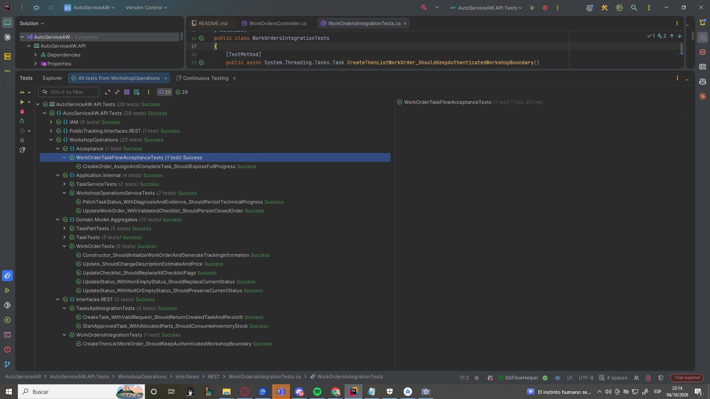

# 6. Product Verification & Validation

## 6.1. Testing Suites & Validation

La estrategia de verificación y validación de AutoService combina pruebas unitarias, pruebas de integración, especificaciones bajo Behavior-Driven Development (BDD) y pruebas de aceptación con el objetivo de evaluar el correcto funcionamiento de la lógica de dominio y de los mecanismos de autenticación y autorización expuestos por la RESTful API.

La suite automatizada del backend se encuentra distribuida principalmente en dos proyectos de pruebas. `AutoServiceAW.Tests` está orientado a la validación de entidades principales, agregados y reglas de negocio, mientras que `AutoServiceAW.API.Tests` concentra las pruebas relacionadas con el bounded context de IAM y la interacción entre los servicios de aplicación y la interfaz REST.

La ejecución completa de la suite automatizada contiene actualmente **31 pruebas**, todas ejecutadas satisfactoriamente, con un resultado de **31 correctas, 0 fallidas y 0 omitidas**.


*Figura 6.1. Ejecución satisfactoria de la suite automatizada de pruebas de AutoService.*

### 6.1.1. Core Entities Unit Tests

Las pruebas unitarias fueron utilizadas para verificar de manera aislada los comportamientos de las principales entidades, agregados y servicios de aplicación de AutoService. Las pruebas siguen la estructura **Arrange, Act, Assert (AAA)**, separando claramente la preparación de los datos, la ejecución del comportamiento y la comprobación de los resultados esperados.

El proyecto `AutoServiceAW.Tests` contiene **26 pruebas automatizadas**, organizadas en dos grupos principales: 13 pruebas ubicadas bajo el namespace `Unit` y 13 pruebas adicionales orientadas al comportamiento de agregados.


*Figura 6.2. Ejecución satisfactoria de las pruebas de entidades principales y agregados.*

Las pruebas a nivel unitario cubren los principales comportamientos de negocio implementados en AutoService.

| Clase de prueba | Cantidad | Principales comportamientos verificados |
|---|---:|---|
| `CustomerTests` | 2 | Creación de clientes y actualización de su información |
| `InventoryItemTests` | 4 | Precio de compra por defecto, reducción de stock, validación de stock insuficiente y aumento de stock |
| `TaskTests` | 3 | Costo de mano de obra por defecto, actualización del costo de materiales y cálculo de utilidad bruta |
| `UserTests` | 2 | Creación de usuarios y actualización del hash de contraseña |
| `VehicleTests` | 2 | Creación de vehículos y actualización de su información |
| `RemainingAggregatesTests` | 13 | Comportamientos asociados a `TaskPart`, `Mechanic`, `Workshop` y `WorkOrder` |
| **Total** | **26** | **Comportamientos de entidades y agregados del dominio** |

Las pruebas de agregados verifican reglas adicionales de negocio relacionadas con cantidades válidas e inválidas de `TaskPart`, cálculo de costos y utilidad, actualización de información de mecánicos, generación del identificador de tenant del taller, valores iniciales de una orden de trabajo, generación del código de tracking, actualización del checklist y transiciones de estado de las órdenes de trabajo.

El listado completo de las pruebas pertenecientes a este proyecto se muestra en la siguiente evidencia.


*Figura 6.3. Pruebas de entidades y agregados disponibles en el backend de AutoService.*

Además de las 26 pruebas orientadas al dominio, el proyecto de pruebas de IAM incluye dos pruebas unitarias para `AuthService`. Estas pruebas utilizan **Moq** para sustituir las dependencias `IUserRepository` e `IUnitOfWork`, permitiendo verificar el servicio de autenticación sin depender de infraestructura de persistencia.

| Prueba unitaria | Componente | Comportamiento verificado |
|---|---|---|
| `SignUpAsync_WithValidData_ShouldCreateUserWithHashedPassword` | `AuthService.SignUpAsync()` | Normalización del correo y del rol, asociación del usuario con un taller, generación del hash de contraseña mediante BCrypt, registro del usuario y ejecución del `UnitOfWork` |
| `SignInAsync_WithValidCredentials_ShouldReturnUserAndJwtToken` | `AuthService.SignInAsync()` | Validación de credenciales y generación de un JWT con los valores esperados de issuer, audience, correo, rol e identificador de taller |

La prueba correspondiente al registro verifica adicionalmente que la contraseña original no sea almacenada directamente. El valor contenido en `PasswordHash` debe ser diferente de la contraseña en texto plano y debe poder ser validado correctamente mediante BCrypt.

La prueba correspondiente al inicio de sesión no se limita únicamente a comprobar la existencia del JWT, sino que también analiza su contenido y verifica información relevante como los claims `email`, `role` y `WorkshopId`. Estos valores son posteriormente utilizados por los recursos protegidos de la API para identificar al usuario autenticado y su contexto de taller.

Considerando las pruebas del dominio y las pruebas de `AuthService`, la solución cuenta actualmente con **28 pruebas automatizadas de nivel unitario**.

Para el módulo de Workshop-Operations se realizaron 2 tipos de pruebas, las que se enfocan en probar los aggregates en solitario y las que se enfocan en probar los servicios del modulo para comprar la conexión y guardado exitoso de datos en la base de datos, usando como referencia los respositories.


*Figura 6.4. Pruebas unitarias de agregados al modulo de workshop operations*

**Aggregates Tests**

TaskPartTest:

- Verificar que el artículo conserve sus detalles de inventario y que los costos, el precio de venta y la ganancia se calculen a partir de la cantidad y los precios.


*Figura 6.5. prueba unitaria 1 de task part*

- Verificar los valores predeterminados de los campos opcionales y los totales cuando no se proporciona un precio de compra.


*Figura 6.6 prueba unitaria 2 de task part*

- Verificar que el constructor rechace cantidades cero o negativas, ya que no representan una asignación de piezas válida.


*Figura 6.7 prueba unitaria 3 de task part*

- Verificar que una marca nula se normalice a una cadena vacía y un nivel de calidad en blanco se reemplace por el valor estándar.


*Figura 6.8 prueba unitaria 4 de task part*

TaskTests:

- Verificar que una tarea se inicialice correctamente y que el costo de mano de obra se establezca por defecto en el 50 % del precio de mano de obra cuando no se proporciona un costo explícito.


*Figura 6.9 prueba unitaria 1 de task*

- Verificar que se utilice un coste de mano de obra proporcionado explícitamente y que se pueda crear una tarea sin un mecánico asignado.


*Figura 6.10 prueba unitaria 2 de task*

- Verificar que Update reemplace los detalles de la tarea y recalcule el coste de mano de obra cuando no se proporciona un coste explícito.


*Figura 6.11 prueba unitaria 3 de task*

- Verificar que un estado vacío preserve el estado actual mientras se actualizan los campos técnicos con la información suministrada.


*Figura 6.12 prueba unitaria 4 de task*

- Verificar que los costes de materiales y una pieza añadida se incluyan en los totales de la tarea, el beneficio bruto y el margen.


*Figura 6.13 prueba unitaria 5 de task*

WorkOrderTests:

- Verificar que la orden de trabajo inicialice sus datos, genere un código de seguimiento válido y comience con la fecha de hoy y una lista de comprobación incompleta.


*Figura 6.14 prueba unitaria 1 de work order*

- Verificar que Update modifique la descripción, la fecha estimada y el precio sin cambiar el código de seguimiento ni la fecha de inicio.


*Figura 6.15 prueba unitaria 2 de work order*

- Verificar que UpdateChecklist actualice cada indicador de la lista de comprobación de la orden de trabajo.


*Figura 6.16 prueba unitaria 3 de work order*

- Verificar que los estados nulos y vacíos se ignoren y no reemplacen el último estado válido de la orden de trabajo.


*Figura 6.17 prueba unitaria 4 de work order*

- Verificar que un estado no vacío reemplace el estado actual de la orden de trabajo.


*Figura 6.18 prueba unitaria 5 de work order*

**Service Tests**


*Figura 6.19 evidencia de prueba de task service exitosa*

TaskServiceTest:

- Verificar que la creación de una tarea la persista a través del repositorio, complete la unidad de trabajo y devuelva la instancia creada.


*Figura 6.20 prueba de task service 1*

- Verifica que la aplicación de parches a los datos técnicos de una tarea actualice la tarea, persista los cambios y complete la unidad de trabajo.


*Figura 6.22 prueba de task service 2*

#### Work Orders & Tasks — Service Unit Tests

Se incorporaron dos pruebas unitarias en `WorkshopOperationsServiceTests`, utilizando MSTest y Moq. Los repositorios y la unidad de trabajo se sustituyen mediante mocks para evaluar los servicios sin depender de una base de datos.

| Prueba | Comportamiento verificado |
|---|---|
| `PatchTaskStatus_WithDiagnosisAndEvidence_ShouldPersistTechnicalProgress` | Actualización del estado, diagnóstico técnico, evidencia y aprobación de una tarea, junto con las llamadas de actualización al repositorio y confirmación de la unidad de trabajo. |
| `UpdateWorkOrder_WithValidatedChecklist_ShouldPersistClosedOrder` | Actualización de una orden con estado `COMPLETED`, precio y cinco indicadores del checklist, junto con las llamadas al repositorio y a la unidad de trabajo. |

El alcance de estas pruebas comprende la actualización de datos y las llamadas a las dependencias simuladas. No incluye persistencia en una base de datos real ni demuestra que se impida cerrar una orden con un checklist incompleto.

**Archivo:** `AutoServiceAW.API.Tests/WorkshopOperations/Application/Internal/WorkshopOperationsServiceTests.cs`.



*Evidencia de ejecución: las dos pruebas de WorkshopOperationsServiceTests aparecen con resultado Success.*

#### Public Tracking — Summary Unit Tests

Se incorporaron cuatro métodos de prueba unitaria en `TrackingSummaryFactoryTests`, utilizando MSTest. Estos verifican el cálculo del progreso de la orden, los costos que se muestran al cliente, el registro de cambios de estado y la selección de los datos públicos de las tareas.

| Prueba Unitaria | Comportamiento verificado |
| --- | --- |
| `CalculateProgress_ShouldUseCompletedTasksAndHandleEmptyOrders` | Calcula el progreso según la proporción de tareas completadas y contempla órdenes sin tareas. |
| `Create_ShouldCalculateCustomerCostsWithoutInternalCosts` | Calcula los subtotales de mano de obra y materiales, y el total del cliente, sin incorporar los costos internos de compra. |
| `UpdateStatus_ShouldRecordOnlyActualStatusChangesWithUtcTimestamps` | Registra los cambios reales de estado con marcas de tiempo UTC y evita registrar como cambio la repetición del mismo estado. |
| `Create_ShouldExposeCustomerTaskDetailsAndOmitInternalFields` | Incluye información útil para el cliente —como diagnóstico, explicación, evidencia y piezas— y excluye campos internos del taller. |

Estas pruebas son relevantes para que el cliente reciba información clara sobre el avance, los costos y el trabajo realizado, mientras se preserva la información operativa interna del taller. Evalúan lógica unitaria; no comprueban la comunicación HTTP ni la persistencia en una base de datos real.

**Archivo:** `AutoServiceAW.API.Tests/PublicTracking/Application/Internal/TrackingSummaryFactoryTests.cs`.


*Figura 6.24 prueba unitaria 1 de public tracking service*


*Figura 6.25 prueba unitaria 2 de public tracking service*


*Figura 6.26 prueba unitaria 3 de public tracking service*


*Figura 6.27 prueba unitaria 4 de public tracking service*

### 6.1.2. Core Integration Tests

Las pruebas de integración fueron utilizadas para verificar la interacción entre la interfaz HTTP y el servicio de autenticación de la aplicación.

La clase `AuthIntegrationTests` utiliza la infraestructura `TestServer` de ASP.NET Core para crear una aplicación web en memoria. Durante la prueba se registran los controllers reales de AutoService y la implementación de `AuthService` dentro del contenedor de dependency injection, mientras que las dependencias externas relacionadas con repositorios y servicios de taller son sustituidas mediante mocks controlados.

Este enfoque permite validar el procesamiento de una solicitud HTTP a través de los principales componentes involucrados sin requerir un servidor externo ni una base de datos de producción.

La prueba de integración implementada se resume a continuación.

| Prueba de integración | Endpoint | Resultado esperado | Verificación principal |
|---|---|---|---|
| `SignIn_WithValidCredentials_ShouldReturnOkAndAuthenticationData` | `POST /api/v1/auth/sign-in` | `200 OK` | Retorno del correo, rol, identificador del taller y un JWT no vacío |

La prueba envía una solicitud HTTP utilizando el cliente proporcionado por ASP.NET Core `TestServer`:

```csharp
var response = await client.PostAsJsonAsync(
    "/api/v1/auth/sign-in",
    request
);
```

La solicitud es procesada por el controller REST y posteriormente por el servicio de autenticación. La respuesta resultante es deserializada y evaluada para comprobar que contenga la información de autenticación esperada.

El flujo de integración validado puede representarse de la siguiente manera:

```text
HTTP Request
    |
    v
AuthController
    |
    v
AuthService
    |
    v
Authentication and JWT generation
    |
    v
HTTP 200 response
```

Aunque las dependencias orientadas a persistencia son sustituidas mediante mocks, dentro de la misma prueba participan el routing HTTP, el descubrimiento de controllers, dependency injection, la ejecución del servicio de aplicación, la generación del JWT y la serialización de la respuesta REST.

Las pruebas automatizadas correspondientes al módulo IAM, incluyendo los niveles unitario, de integración y de aceptación, se muestran en la siguiente evidencia.


*Figura 6.28. Pruebas unitarias, de integración y de aceptación del módulo IAM ejecutadas satisfactoriamente.*


Por el lado del modulo de Workshop Operations, se contó con 2 pruebas de integración, una sobre el funcionamineto de la api y la segunda sobre la comunicación con el modulo de inventory.


*Figura 6.29. evidencia de pruebas de integracion exitosas*

**TaskApiIntegrationTests:**

- Verificar que la publicación de una solicitud de tarea válida devuelva HTTP 201, persiste la tarea con los valores esperados y completa la unidad de trabajo.


*Figura 6.30. prueba de integración 1a*


*Figura 6.31. prueba de integración 1b*


*Figura 6.32. prueba de integración 1c*

- Verifica que el inicio de una tarea aprobada consuma las existencias asignadas a través del servicio de aplicación de gestión de inventario.


*Figura 6.33. prueba de integración 2a*


*Figura 6.34. prueba de integración 2b*


*Figura 6.35. prueba de integración 2c*


*Figura 6.36. prueba de integración 2d*

#### Work Orders — HTTP Integration Test

La clase `WorkOrdersIntegrationTests` incorpora la prueba `CreateThenListWorkOrder_ShouldKeepAuthenticatedWorkshopBoundary`.

La prueba utiliza ASP.NET Core `TestServer`, el controller real, una identidad de prueba y un mock de `IWorkOrderService`. Crea una orden mediante `POST /api/v1/workorders` y consulta el listado mediante `GET /api/v1/workorders`.

Se comprueban las respuestas `201 Created` y `200 OK`, la asociación de la orden con el taller autenticado `WS-01` y la descripción registrada en la respuesta. También se verifica que el servicio consulte las órdenes del taller esperado.

La prueba evalúa routing, autenticación de prueba, controller y serialización HTTP con el servicio sustituido. No incluye persistencia real ni demuestra por sí sola el aislamiento completo entre distintos talleres.

**Archivo:** `AutoServiceAW.API.Tests/WorkshopOperations/Interfaces/REST/WorkOrdersIntegrationTests.cs`.


*Evidencia de ejecución: CreateThenListWorkOrder_ShouldKeepAuthenticatedWorkshopBoundary aparece con resultado Success.*

#### Public Tracking — Integration Test

Se implementó una prueba de integración para el endpoint de seguimiento público mediante ASP.NET Core `TestServer`. Las dependencias se sustituyen con mocks para validar las respuestas HTTP y la estructura de los datos sin conectarse a una base de datos real.

| Prueba de Integracion | Comportamiento verificado |
| --- | --- |
| `GetSummaryByTrackingCodeShouldReturnSafeOrderDataAndRejectIdOnlyTaskAccess` | Comprueba que un código válido permita consultar el resumen, que un código desconocido devuelva `404 Not Found` y que no se puedan consultar tareas usando únicamente el identificador interno de la orden. También verifica que las respuestas omitan datos internos, como costos de compra e identificadores internos. |

Esta prueba es relevante porque verifica que el cliente pueda consultar el estado de su servicio mediante el código de seguimiento y reciba únicamente la información prevista para la vista pública.

Archivo: `AutoServiceAW.API.Tests/PublicTracking/Interfaces/REST/TrackingIntegrationTests.cs`


*Figura 6.38. prueba de integración de public tracking service*


*Figura 6.39. prueba de integración de public tracking service*


### 6.1.3. Core Behavior-Driven Development

Behavior-Driven Development (BDD) fue utilizado para representar los requisitos de autenticación desde la perspectiva del usuario mediante escenarios escritos en lenguaje Gherkin.

La especificación BDD se encuentra ubicada en:

```text
AutoServiceAW.API.Tests/IAM/BDD/Features/Authentication.feature
```

La feature describe el comportamiento esperado para la autenticación y el acceso según roles:

```gherkin
Feature: Authentication and role-based access

  As an AutoService user
  I want to authenticate with my registered credentials
  So that I can access the application according to my assigned role
```

Actualmente se han definido dos escenarios.

| Scenario | Propósito |
|---|---|
| `Administrator signs in with valid credentials` | Validar la autenticación satisfactoria de un administrador, su rol, la generación del JWT y su acceso al área administrativa |
| `User signs in with invalid credentials` | Validar el rechazo de credenciales incorrectas y comprobar que no se genere un JWT |

El escenario positivo de autenticación se encuentra especificado de la siguiente manera:

```gherkin
Scenario: Administrator signs in with valid credentials
  Given an administrator with email "admin@autoservice.com" is registered
  And the administrator has password "SecurePassword123"
  When the administrator signs in with valid credentials
  Then the authentication request should be successful
  And the response should contain the role "admin"
  And the response should contain a JWT access token
  And the administrator should have access to the administration area
```

Por otro lado, el escenario negativo verifica el comportamiento esperado cuando el usuario proporciona una contraseña incorrecta:

```gherkin
Scenario: User signs in with invalid credentials
  Given a user with email "admin@autoservice.com" is registered
  When the user signs in with an incorrect password
  Then the authentication request should be rejected
  And the response should not contain a JWT access token
```

Estos escenarios representan los comportamientos esperados de autenticación y control de acceso utilizados posteriormente por las aplicaciones Web y Native Mobile de AutoService.

En el estado actual del repositorio, el archivo `.feature` se encuentra implementado como una especificación de comportamiento. Sin embargo, todavía no se han incorporado Step Definitions mediante SpecFlow, Reqnroll o bindings asociados a `[Given]`, `[When]` y `[Then]`.

Por esta razón, los dos escenarios son documentados actualmente como **especificaciones BDD**, pero **no forman parte de las 31 pruebas automatizadas reportadas en la ejecución de la suite de pruebas**.

Para el modulo de Workshop Operations se tiene la siguiente ruta donde está el archivo .feature que le corresponse

```text
AutoServiceAW.API.Tests/WorkshopOperations/BDD/Features/WorkshopOperations.feature
```

```gherkin
Scenario: Register a maintenance task for an active work order
    Given an active work order exists
    When an administrator registers a task with its description, mechanic, status, and estimated time
    Then the task is associated with the work order
    And the task is saved with its assigned mechanic and estimated time
```

```gherkin
Scenario: Update a task's status and estimated time
    Given a maintenance task belongs to an active work order
    When an administrator or mechanic updates the task status and estimated time
    Then the task reflects the new status and estimated time
    And the task remains associated with the same work order
```

#### Work Orders & Tasks — Lifecycle Specification

El archivo `AutoServiceAW.API.Tests/WorkshopOperations/BDD/Features/WorkOrderTaskLifecycle.feature` especifica dos escenarios del ciclo de vida de órdenes y tareas:

```gherkin
Feature: Work order and task lifecycle

  As a workshop administrator or mechanic
  I want to coordinate work orders and their assigned tasks
  So that the customer can see reliable repair progress

  Scenario: Approved task advances the work order progress
    Given a work order exists for a customer reported vehicle problem
    And an approved task is assigned to a mechanic
    When the mechanic starts and completes the assigned task
    Then the task status should be "COMPLETED"
    And the work order progress should show 100 percent

  Scenario: Unapproved task cannot be started
    Given a work order exists for a customer reported vehicle problem
    And a pending task has not been approved by an administrator
    When the mechanic attempts to start the task
    Then the request should be rejected
    And no inventory material should be consumed
```

Estos escenarios describen el comportamiento esperado. No disponen de Step Definitions y no se contabilizan como pruebas automatizadas ejecutadas. El escenario de rechazo de una tarea no aprobada requiere validación adicional.

####  Public Tracking — Behavior-Driven Development

La especificación BDD del módulo de seguimiento público se encuentra en:

```text
tests/bdd/features/customer-tracking.feature
```

La feature describe el comportamiento esperado cuando un cliente consulta una orden mediante su código público de seguimiento:

```gherkin
Feature: Customer tracks a work order using its public tracking code
  As a customer
  I want to search for my service using its tracking code
  So that I can see its progress without seeing another customer's order
```

Se establece dos escenarios:

| Escenario | Propósito |
| --- | --- |
| `Customer views the public tracking summary for a valid code` | Especificar que un código válido muestre el estado, el progreso calculado por el backend, la fecha estimada, el historial, los detalles de las tareas y el desglose de costos para el cliente. También contempla que no se ofrezcan acciones de pago ni se muestren datos de otras órdenes. |
| `Customer receives clear feedback for an unknown code`| Especificar que un código inexistente genere un mensaje claro y que no se muestren datos de una orden. |

El escenario positivo de consulta se encuentra especificado de la siguiente manera:

```gherkin
Scenario: Customer views the public tracking summary for a valid code
  Given the customer opens the public tracking page
  When the customer submits a valid tracking code
  Then the associated order status and backend-calculated service progress are displayed
  And the estimated delivery date and service history are displayed
  And the task details and customer-facing cost breakdown are displayed
  And no payment action or payment receipt is offered
  And details from unrelated orders are not displayed
```

Por otro lado, el escenario negativo verifica el comportamiento cuando el cliente ingresa un código que no corresponde a una orden:

```gherkin
Scenario: Customer receives clear feedback for an unknown code
  Given the customer opens the public tracking page
  When the customer submits a code that does not exist
  Then the page displays the tracking code not found message
  And no order details are displayed
```

Estos escenarios describen cómo el cliente consulta el avance y los detalles públicos de su servicio, y qué respuesta recibe cuando el código no existe.

### 6.1.4. Core System Tests

La validación actual a nivel de sistema se concentra en los flujos de autenticación y autorización expuestos por la RESTful API de AutoService.

Se implementaron dos Acceptance Tests que ejecutan flujos compuestos por múltiples pasos utilizando ASP.NET Core `TestServer`, autenticación JWT, middleware de autorización, REST controllers y el servicio de aplicación correspondiente al módulo IAM.

Las dependencias asociadas a repositorios y persistencia son controladas mediante mocks, lo que permite validar de manera determinística el comportamiento de autenticación y autorización.

Las pruebas implementadas se resumen a continuación.

| Acceptance Test | Flujo validado | Resultado esperado |
|---|---|---|
| `RegisterWorkshop_Login_AndAccessAdminEndpoint_ShouldSucceed` | Registro de taller → Inicio de sesión → Obtención de JWT → Acceso a endpoint de administrador | `201 Created` → `200 OK` → JWT generado → `201 Created` |
| `Mechanic_WithValidToken_ShouldNotAccessAdminSignUpEndpoint` | Inicio de sesión de mecánico → Obtención de JWT → Intento de acceso a operación exclusiva de administrador | `200 OK` → JWT generado → `403 Forbidden` |

La primera prueba de aceptación valida el recorrido satisfactorio correspondiente al administrador del taller.

Inicialmente se ejecuta:

```text
POST /api/v1/auth/register-workshop
```

y se verifica que la operación de registro retorne `201 Created`, genere una cuenta con rol `admin` y asocie al administrador con el identificador correspondiente al taller creado.

Posteriormente, el administrador realiza el inicio de sesión mediante:

```text
POST /api/v1/auth/sign-in
```

La respuesta debe retornar `200 OK`, el rol `admin`, el `workshopId` correspondiente y un JWT válido.

El token obtenido es utilizado posteriormente como Bearer Token para acceder al endpoint encargado de crear usuarios desde una cuenta administrativa.

Durante esta operación, la prueba envía intencionalmente un identificador de taller inválido (`WS-INVALID`) dentro del request y verifica que dicho valor sea ignorado. El mecánico creado debe utilizar el identificador del taller perteneciente al administrador autenticado, obtenido desde el contexto proporcionado por el JWT.

Este comportamiento permite verificar una medida de aislamiento entre tenants, ya que el cliente no puede asignar arbitrariamente un usuario a otro taller mediante el contenido del request.

La segunda prueba de aceptación evalúa las restricciones de autorización aplicadas al rol `mechanic`.

El mecánico realiza correctamente el inicio de sesión y obtiene un JWT válido. Sin embargo, cuando dicho token es utilizado para acceder al endpoint exclusivo de administradores encargado de crear nuevos usuarios, la aplicación debe responder con:

```text
403 Forbidden
```

La prueba también verifica que el método `AddAsync()` del repositorio no sea ejecutado después del rechazo de autorización. De esta manera se comprueba que una solicitud prohibida no genere efectos secundarios sobre la persistencia.

Para el módulo de Workshop-Operations y Mechanic se utilizó Selenium para realizar las pruebas a nivel de sistema.

**Instalar dependencias de Selenium**


*Figura 6.40 instalacion de dependencias de Selenium*

**Instalar configuraciones de web driver**


*Figura 6.41 instalar config web driver*

**Instalar Vitest**


*Figura 6.42 instalar vitest*

Contemplando el escenario en donde un Administrador del taller se dirige a la pestada de work orders,según el fujo debería poer acceder al forumlario para crear una nueva order de trabajo dado el vehiculo asignado y el mecánico responsable de esta ordén.

Por otro lado, para el modulo de mechanic se comporbó el flujo de un mecanico desde que inicia sesión en la app web, se dirige a ver las tareas de su orden de trabajo asignada y finalmente accede al formulario para crear una nuea tarea para esa orden de trabajo.

**Captura de la prueba realizada para estos dos contextos**

*Figura 6.43 prueba de uso de selenium para workshop y mechanic*

#### Work Orders & Tasks — API Acceptance Test

La clase `WorkOrderTaskFlowAcceptanceTests` incorpora la prueba `CreateOrder_AssignAndCompleteTask_ShouldExposeFullProgress`, que ejecuta el siguiente recorrido mediante solicitudes HTTP:

1. Crear una orden con el problema reportado por el cliente.
2. Crear una tarea aprobada y asignarla a un mecánico.
3. Actualizar la tarea a `IN_PROGRESS`.
4. Actualizar la tarea a `COMPLETED`.
5. Consultar las tareas asociadas a la orden.

La prueba utiliza ASP.NET Core `TestServer`, controllers y servicios de aplicación reales, autenticación de prueba y repositorios sustituidos mediante Moq. Comprueba los códigos HTTP esperados, el mecánico asignado y el estado final de la tarea.

A partir de la respuesta de consulta, la propia prueba calcula el porcentaje de tareas completadas y verifica un resultado del 100 % para el caso preparado.

Su alcance corresponde a una prueba de aceptación del flujo de la API con persistencia simulada. No ejecuta la interfaz Web o Mobile ni comprueba visualmente el progreso mostrado al usuario.

**Archivo:** `AutoServiceAW.API.Tests/WorkshopOperations/Acceptance/WorkOrderTaskFlowAcceptanceTests.cs`.


*Evidencia de ejecución: CreateOrder_AssignAndCompleteTask_ShouldExposeFullProgress aparece con resultado Success.*

#### Public Tracking — System Tests with Selenium

Para el módulo de seguimiento público se implementaron dos pruebas de sistema con Selenium y TestNG. Estas pruebas recorren la página `/tracking` en un navegador y verifican la respuesta de la interfaz ante un código de seguimiento válido y otro inexistente.

**Prueba: `customerCanViewProgressForTheirTrackingCode`**

Esta prueba ingresa un código de seguimiento válido y verifica que se muestren el estado de la orden, el progreso calculado por el backend, la fecha estimada, el historial, las tareas y el desglose de costos. También comprueba que no se ofrezcan acciones de pago ni se muestre el formulario de búsqueda junto con el resumen.

Es relevante para el negocio porque permite comprobar que el cliente pueda consultar el avance y los detalles de su servicio desde la aplicación web.


*Figura 6.45. Prueba Selenium para consultar una orden con un código válido.*

**Prueba: `customerReceivesNotFoundMessageForUnknownTrackingCode`**

Esta prueba ingresa un código que no corresponde a una orden y verifica que aparezca el mensaje de no encontrado, que el formulario de búsqueda permanezca disponible y que no se muestren los detalles de una orden.

Es relevante para el negocio porque entrega una respuesta clara cuando el cliente ingresa un código incorrecto y evita mostrar información de una orden no encontrada.


*Figura 6.46. Prueba Selenium para un código de seguimiento inexistente.*

**Archivo:** `tests/system/src/test/java/system/CustomerTrackingSystemTest.java`


La distribución actual de las pruebas automatizadas es la siguiente:

| Nivel de prueba | Pruebas automatizadas |
|---|---:|
| Entidades y agregados principales | 29 |
| Pruebas unitarias del servicio IAM | 2 |
| Pruebas unitarias del servicio Workshop-Operations | 1 |
| Pruebas de integración REST | 2 |
| Acceptance Tests / pruebas de sistema | 3 |
| **Total de pruebas automatizadas** | **49** |
| Escenarios BDD especificados en Gherkin | **4** *(aún no automatizados)* |

El resultado de ejecución de **49 pruebas correctas, 0 fallidas y 0 omitidas** establece la línea base actual de verificación automatizada del backend de AutoService.

Los escenarios BDD permanecen como especificaciones de comportamiento y podrán incorporarse posteriormente a la suite de ejecución automatizada una vez que se implementen sus respectivas Step Definitions.
