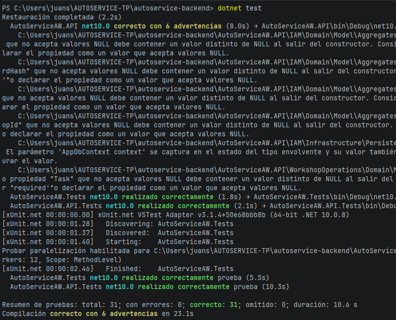
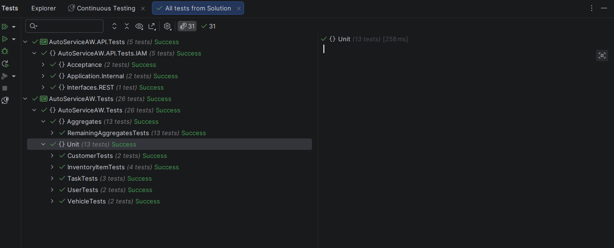
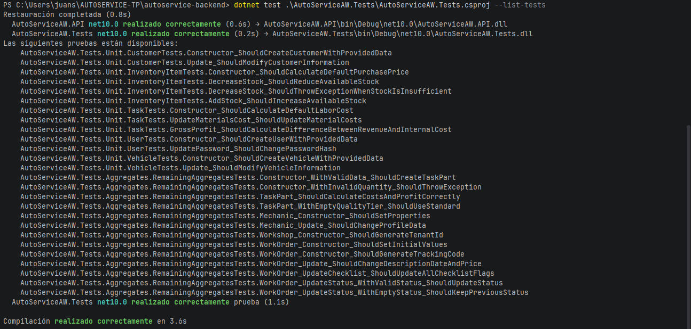
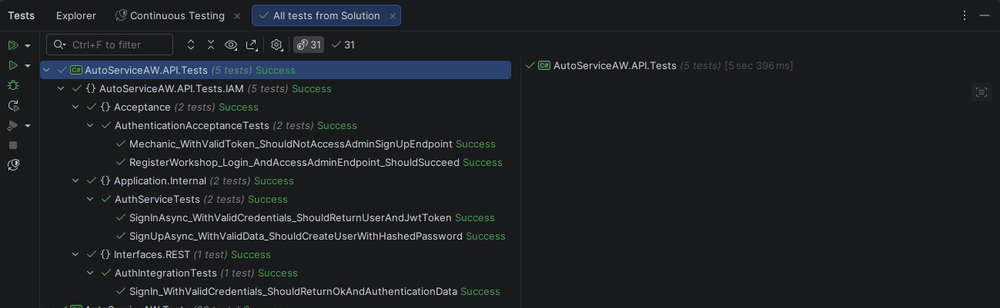

# 6. Product Verification & Validation

## 6.1. Testing Suites & Validation

La estrategia de verificación y validación de AutoService combina pruebas unitarias, pruebas de integración, especificaciones bajo Behavior-Driven Development (BDD) y pruebas de aceptación con el objetivo de evaluar el correcto funcionamiento de la lógica de dominio y de los mecanismos de autenticación y autorización expuestos por la RESTful API.

La suite automatizada del backend se encuentra distribuida principalmente en dos proyectos de pruebas. `AutoServiceAW.Tests` está orientado a la validación de entidades principales, agregados y reglas de negocio, mientras que `AutoServiceAW.API.Tests` concentra las pruebas relacionadas con el bounded context de IAM y la interacción entre los servicios de aplicación y la interfaz REST.

La ejecución completa de la suite automatizada contiene actualmente **31 pruebas**, todas ejecutadas satisfactoriamente, con un resultado de **31 correctas, 0 fallidas y 0 omitidas**.



*Figura 6.1. Ejecución satisfactoria de la suite automatizada de pruebas de AutoService.*

### 6.1.1. Core Entities Unit Tests

Las pruebas unitarias fueron utilizadas para verificar de manera aislada los comportamientos de las principales entidades, agregados y servicios de aplicación de AutoService. Las pruebas siguen la estructura **Arrange, Act, Assert (AAA)**, separando claramente la preparación de los datos, la ejecución del comportamiento y la comprobación de los resultados esperados.

El proyecto `AutoServiceAW.Tests` contiene **26 pruebas automatizadas**, organizadas en dos grupos principales: 13 pruebas ubicadas bajo el namespace `Unit` y 13 pruebas adicionales orientadas al comportamiento de agregados.



*Figura 6.2. Ejecución satisfactoria de las pruebas de entidades principales y agregados.*

Las pruebas a nivel unitario cubren los principales comportamientos de negocio implementados en AutoService.

| Clase de prueba | Cantidad | Principales comportamientos verificados |
|---|---:|---|
| `CustomerTests` | 2 | Creación de clientes y actualización de su información |
| `InventoryItemTests` | 4 | Precio de compra por defecto, reducción de stock, validación de stock insuficiente y aumento de stock |
| `TaskTests` | 3 | Costo de mano de obra por defecto, actualización del costo de materiales y cálculo de utilidad bruta |
| `UserTests` | 2 | Creación de usuarios y actualización del hash de contraseña |
| `VehicleTests` | 2 | Creación de vehículos y actualización de su información |
| `RemainingAggregatesTests` | 13 | Comportamientos asociados a `TaskPart`, `Mechanic`, `Workshop` y `WorkOrder` |
| **Total** | **26** | **Comportamientos de entidades y agregados del dominio** |

Las pruebas de agregados verifican reglas adicionales de negocio relacionadas con cantidades válidas e inválidas de `TaskPart`, cálculo de costos y utilidad, actualización de información de mecánicos, generación del identificador de tenant del taller, valores iniciales de una orden de trabajo, generación del código de tracking, actualización del checklist y transiciones de estado de las órdenes de trabajo.

El listado completo de las pruebas pertenecientes a este proyecto se muestra en la siguiente evidencia.



*Figura 6.3. Pruebas de entidades y agregados disponibles en el backend de AutoService.*

Además de las 26 pruebas orientadas al dominio, el proyecto de pruebas de IAM incluye dos pruebas unitarias para `AuthService`. Estas pruebas utilizan **Moq** para sustituir las dependencias `IUserRepository` e `IUnitOfWork`, permitiendo verificar el servicio de autenticación sin depender de infraestructura de persistencia.

| Prueba unitaria | Componente | Comportamiento verificado |
|---|---|---|
| `SignUpAsync_WithValidData_ShouldCreateUserWithHashedPassword` | `AuthService.SignUpAsync()` | Normalización del correo y del rol, asociación del usuario con un taller, generación del hash de contraseña mediante BCrypt, registro del usuario y ejecución del `UnitOfWork` |
| `SignInAsync_WithValidCredentials_ShouldReturnUserAndJwtToken` | `AuthService.SignInAsync()` | Validación de credenciales y generación de un JWT con los valores esperados de issuer, audience, correo, rol e identificador de taller |

La prueba correspondiente al registro verifica adicionalmente que la contraseña original no sea almacenada directamente. El valor contenido en `PasswordHash` debe ser diferente de la contraseña en texto plano y debe poder ser validado correctamente mediante BCrypt.

La prueba correspondiente al inicio de sesión no se limita únicamente a comprobar la existencia del JWT, sino que también analiza su contenido y verifica información relevante como los claims `email`, `role` y `WorkshopId`. Estos valores son posteriormente utilizados por los recursos protegidos de la API para identificar al usuario autenticado y su contexto de taller.

Considerando las pruebas del dominio y las pruebas de `AuthService`, la solución cuenta actualmente con **28 pruebas automatizadas de nivel unitario**.

### 6.1.2. Core Integration Tests

Las pruebas de integración fueron utilizadas para verificar la interacción entre la interfaz HTTP y el servicio de autenticación de la aplicación.

La clase `AuthIntegrationTests` utiliza la infraestructura `TestServer` de ASP.NET Core para crear una aplicación web en memoria. Durante la prueba se registran los controllers reales de AutoService y la implementación de `AuthService` dentro del contenedor de dependency injection, mientras que las dependencias externas relacionadas con repositorios y servicios de taller son sustituidas mediante mocks controlados.

Este enfoque permite validar el procesamiento de una solicitud HTTP a través de los principales componentes involucrados sin requerir un servidor externo ni una base de datos de producción.

La prueba de integración implementada se resume a continuación.

| Prueba de integración | Endpoint | Resultado esperado | Verificación principal |
|---|---|---|---|
| `SignIn_WithValidCredentials_ShouldReturnOkAndAuthenticationData` | `POST /api/v1/auth/sign-in` | `200 OK` | Retorno del correo, rol, identificador del taller y un JWT no vacío |

La prueba envía una solicitud HTTP utilizando el cliente proporcionado por ASP.NET Core `TestServer`:

```csharp
var response = await client.PostAsJsonAsync(
    "/api/v1/auth/sign-in",
    request
);
```

La solicitud es procesada por el controller REST y posteriormente por el servicio de autenticación. La respuesta resultante es deserializada y evaluada para comprobar que contenga la información de autenticación esperada.

El flujo de integración validado puede representarse de la siguiente manera:

```text
HTTP Request
    |
    v
AuthController
    |
    v
AuthService
    |
    v
Authentication and JWT generation
    |
    v
HTTP 200 response
```

Aunque las dependencias orientadas a persistencia son sustituidas mediante mocks, dentro de la misma prueba participan el routing HTTP, el descubrimiento de controllers, dependency injection, la ejecución del servicio de aplicación, la generación del JWT y la serialización de la respuesta REST.

Las pruebas automatizadas correspondientes al módulo IAM, incluyendo los niveles unitario, de integración y de aceptación, se muestran en la siguiente evidencia.



*Figura 6.4. Pruebas unitarias, de integración y de aceptación del módulo IAM ejecutadas satisfactoriamente.*

### 6.1.3. Core Behavior-Driven Development

Behavior-Driven Development (BDD) fue utilizado para representar los requisitos de autenticación desde la perspectiva del usuario mediante escenarios escritos en lenguaje Gherkin.

La especificación BDD se encuentra ubicada en:

```text
AutoServiceAW.API.Tests/IAM/BDD/Features/Authentication.feature
```

La feature describe el comportamiento esperado para la autenticación y el acceso según roles:

```gherkin
Feature: Authentication and role-based access

  As an AutoService user
  I want to authenticate with my registered credentials
  So that I can access the application according to my assigned role
```

Actualmente se han definido dos escenarios.

| Scenario | Propósito |
|---|---|
| `Administrator signs in with valid credentials` | Validar la autenticación satisfactoria de un administrador, su rol, la generación del JWT y su acceso al área administrativa |
| `User signs in with invalid credentials` | Validar el rechazo de credenciales incorrectas y comprobar que no se genere un JWT |

El escenario positivo de autenticación se encuentra especificado de la siguiente manera:

```gherkin
Scenario: Administrator signs in with valid credentials
  Given an administrator with email "admin@autoservice.com" is registered
  And the administrator has password "SecurePassword123"
  When the administrator signs in with valid credentials
  Then the authentication request should be successful
  And the response should contain the role "admin"
  And the response should contain a JWT access token
  And the administrator should have access to the administration area
```

Por otro lado, el escenario negativo verifica el comportamiento esperado cuando el usuario proporciona una contraseña incorrecta:

```gherkin
Scenario: User signs in with invalid credentials
  Given a user with email "admin@autoservice.com" is registered
  When the user signs in with an incorrect password
  Then the authentication request should be rejected
  And the response should not contain a JWT access token
```

Estos escenarios representan los comportamientos esperados de autenticación y control de acceso utilizados posteriormente por las aplicaciones Web y Native Mobile de AutoService.

En el estado actual del repositorio, el archivo `.feature` se encuentra implementado como una especificación de comportamiento. Sin embargo, todavía no se han incorporado Step Definitions mediante SpecFlow, Reqnroll o bindings asociados a `[Given]`, `[When]` y `[Then]`.

Por esta razón, los dos escenarios son documentados actualmente como **especificaciones BDD**, pero **no forman parte de las 31 pruebas automatizadas reportadas en la ejecución de la suite de pruebas**.

### 6.1.4. Core System Tests

La validación actual a nivel de sistema se concentra en los flujos de autenticación y autorización expuestos por la RESTful API de AutoService.

Se implementaron dos Acceptance Tests que ejecutan flujos compuestos por múltiples pasos utilizando ASP.NET Core `TestServer`, autenticación JWT, middleware de autorización, REST controllers y el servicio de aplicación correspondiente al módulo IAM.

Las dependencias asociadas a repositorios y persistencia son controladas mediante mocks, lo que permite validar de manera determinística el comportamiento de autenticación y autorización.

Las pruebas implementadas se resumen a continuación.

| Acceptance Test | Flujo validado | Resultado esperado |
|---|---|---|
| `RegisterWorkshop_Login_AndAccessAdminEndpoint_ShouldSucceed` | Registro de taller → Inicio de sesión → Obtención de JWT → Acceso a endpoint de administrador | `201 Created` → `200 OK` → JWT generado → `201 Created` |
| `Mechanic_WithValidToken_ShouldNotAccessAdminSignUpEndpoint` | Inicio de sesión de mecánico → Obtención de JWT → Intento de acceso a operación exclusiva de administrador | `200 OK` → JWT generado → `403 Forbidden` |

La primera prueba de aceptación valida el recorrido satisfactorio correspondiente al administrador del taller.

Inicialmente se ejecuta:

```text
POST /api/v1/auth/register-workshop
```

y se verifica que la operación de registro retorne `201 Created`, genere una cuenta con rol `admin` y asocie al administrador con el identificador correspondiente al taller creado.

Posteriormente, el administrador realiza el inicio de sesión mediante:

```text
POST /api/v1/auth/sign-in
```

La respuesta debe retornar `200 OK`, el rol `admin`, el `workshopId` correspondiente y un JWT válido.

El token obtenido es utilizado posteriormente como Bearer Token para acceder al endpoint encargado de crear usuarios desde una cuenta administrativa.

Durante esta operación, la prueba envía intencionalmente un identificador de taller inválido (`WS-INVALID`) dentro del request y verifica que dicho valor sea ignorado. El mecánico creado debe utilizar el identificador del taller perteneciente al administrador autenticado, obtenido desde el contexto proporcionado por el JWT.

Este comportamiento permite verificar una medida de aislamiento entre tenants, ya que el cliente no puede asignar arbitrariamente un usuario a otro taller mediante el contenido del request.

La segunda prueba de aceptación evalúa las restricciones de autorización aplicadas al rol `mechanic`.

El mecánico realiza correctamente el inicio de sesión y obtiene un JWT válido. Sin embargo, cuando dicho token es utilizado para acceder al endpoint exclusivo de administradores encargado de crear nuevos usuarios, la aplicación debe responder con:

```text
403 Forbidden
```

La prueba también verifica que el método `AddAsync()` del repositorio no sea ejecutado después del rechazo de autorización. De esta manera se comprueba que una solicitud prohibida no genere efectos secundarios sobre la persistencia.

La distribución actual de las pruebas automatizadas es la siguiente:

| Nivel de prueba | Pruebas automatizadas |
|---|---:|
| Entidades y agregados principales | 26 |
| Pruebas unitarias del servicio IAM | 2 |
| Pruebas de integración REST | 1 |
| Acceptance Tests / pruebas de sistema | 2 |
| **Total de pruebas automatizadas** | **31** |
| Escenarios BDD especificados en Gherkin | **2** *(aún no automatizados)* |

El resultado de ejecución de **31 pruebas correctas, 0 fallidas y 0 omitidas** establece la línea base actual de verificación automatizada del backend de AutoService.

Los escenarios BDD permanecen como especificaciones de comportamiento y podrán incorporarse posteriormente a la suite de ejecución automatizada una vez que se implementen sus respectivas Step Definitions.