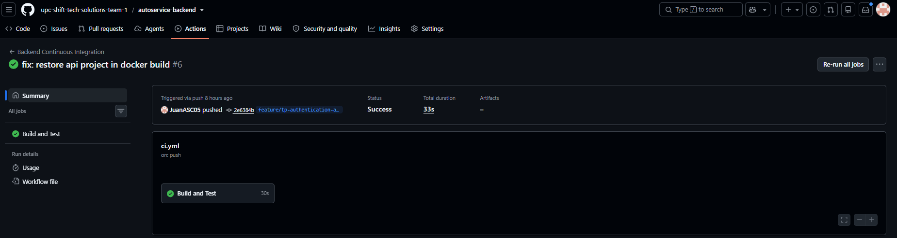
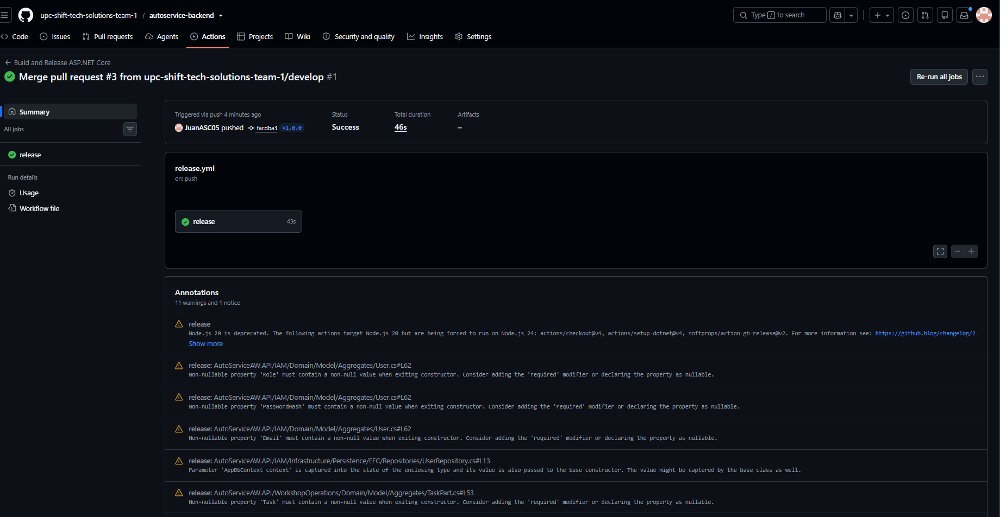
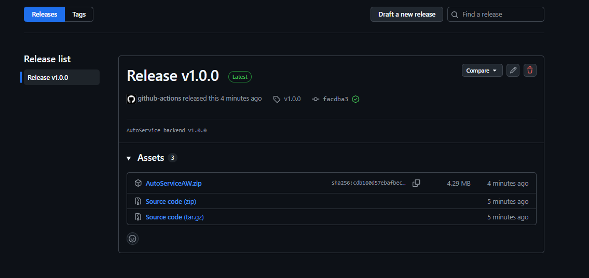
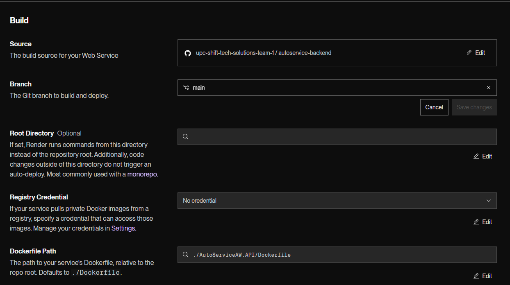
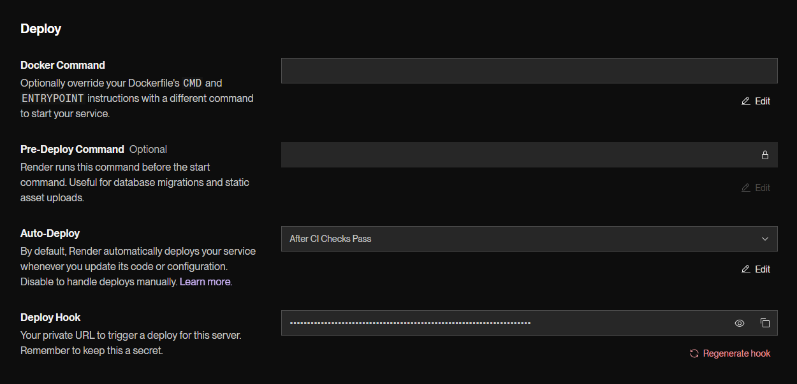

# 7. DevOps Practices

## 7.1. Continuous Integration

La estrategia de Continuous Integration de AutoService se implementa mediante GitHub Actions sobre el repositorio del backend. Su objetivo es validar automáticamente que los cambios incorporados al código fuente puedan restaurar sus dependencias, compilar correctamente y superar la suite automatizada de pruebas antes de continuar hacia etapas posteriores de integración y entrega.

El workflow utilizado se encuentra definido en:

```text
.github/workflows/ci.yml
```

y recibe el nombre de:

```text
Backend Continuous Integration
```

El pipeline se ejecuta automáticamente ante cambios realizados mediante `push` sobre las ramas `main`, `develop` y cualquier rama que siga el patrón `feature/**`. Asimismo, se ejecuta ante Pull Requests cuyo destino sea `main` o `develop`.

Esta configuración permite verificar tanto el trabajo realizado durante el desarrollo de nuevas funcionalidades como los cambios que se integran hacia las ramas principales del proyecto.



*Figura 7.1. Ejecución satisfactoria del workflow Backend Continuous Integration mediante GitHub Actions.*

### 7.1.1. Tools and Practices

La principal herramienta empleada para Continuous Integration es **GitHub Actions**, integrada directamente con el repositorio GitHub del backend de AutoService.

El workflow utiliza un runner basado en `ubuntu-latest` y configura automáticamente el entorno requerido para compilar y verificar la solución ASP.NET Core.

Las principales herramientas y prácticas utilizadas se resumen a continuación:

| Herramienta o práctica | Aplicación en AutoService |
|---|---|
| GitHub Actions | Automatización del proceso de integración mediante workflows versionados dentro del repositorio |
| GitHub | Repositorio central de código fuente y origen de los eventos que activan el pipeline |
| .NET 10 | Entorno utilizado para restaurar, compilar y ejecutar las pruebas del backend |
| `ubuntu-latest` | Runner utilizado para ejecutar el job de Continuous Integration |
| GitFlow | Uso de ramas `feature/**`, `develop` y `main` como parte del flujo de integración |
| Pull Requests | Validación automática de cambios antes de su integración hacia `develop` o `main` |
| Automated Testing | Ejecución automática de la suite de pruebas después de una compilación satisfactoria |
| Least-Privilege Permissions | El workflow utiliza únicamente el permiso `contents: read` para acceder al código fuente |

La automatización se activa mediante la siguiente configuración:

```yaml
on:
  push:
    branches:
      - main
      - develop
      - 'feature/**'

  pull_request:
    branches:
      - main
      - develop
```

De esta manera, las ramas de nuevas funcionalidades son verificadas desde etapas tempranas del desarrollo, mientras que los Pull Requests hacia `develop` y `main` vuelven a ejecutar la validación antes de integrar los cambios.

El workflow también limita sus permisos a:

```yaml
permissions:
  contents: read
```

Esto permite que el proceso de Continuous Integration pueda consultar el contenido requerido del repositorio sin disponer de permisos de escritura que no son necesarios para la ejecución del build y las pruebas.

### 7.1.2. Build & Test Suite Pipeline Components

El pipeline de Continuous Integration contiene un único job denominado `build-and-test`, presentado en GitHub Actions como **Build and Test**.

La ejecución utiliza:

```yaml
runs-on: ubuntu-latest
```

y se compone de cinco etapas principales.

| Orden | Componente | Herramienta / comando | Propósito |
|---:|---|---|---|
| 1 | Checkout source code | `actions/checkout@v4` | Obtiene el código correspondiente al commit que activó el workflow |
| 2 | Setup .NET 10 | `actions/setup-dotnet@v4` | Configura el SDK `.NET 10.0.x` dentro del runner |
| 3 | Restore dependencies | `dotnet restore AutoServiceAW.sln` | Restaura las dependencias NuGet utilizadas por la solución |
| 4 | Build solution | `dotnet build AutoServiceAW.sln --configuration Release --no-restore` | Compila la solución completa utilizando configuración `Release` |
| 5 | Run automated tests | `dotnet test AutoServiceAW.sln --configuration Release --no-build --verbosity normal` | Ejecuta la suite automatizada de pruebas sobre la solución previamente compilada |

El flujo del pipeline puede representarse de la siguiente manera:

```text
Push / Pull Request
        |
        v
Checkout source code
        |
        v
Setup .NET 10
        |
        v
Restore dependencies
        |
        v
Build solution (Release)
        |
        v
Run automated tests
        |
        v
Continuous Integration validation
```

La restauración de dependencias se realiza una sola vez mediante:

```bash
dotnet restore AutoServiceAW.sln
```

Posteriormente, la compilación utiliza la opción `--no-restore`:

```bash
dotnet build AutoServiceAW.sln --configuration Release --no-restore
```

Esto evita repetir innecesariamente la restauración de paquetes durante la fase de build.

De manera similar, las pruebas utilizan `--no-build`:

```bash
dotnet test AutoServiceAW.sln --configuration Release --no-build --verbosity normal
```

por lo que la suite se ejecuta utilizando los artefactos generados durante la etapa anterior.

La solución utilizada por el pipeline incluye tanto el proyecto principal del backend como los proyectos de pruebas. Por ello, la etapa `Run automated tests` ejecuta la suite documentada en el Capítulo VI, cuya línea base actual corresponde a **31 pruebas automatizadas ejecutadas satisfactoriamente**.

La evidencia presentada en la Figura 7.1 muestra una ejecución real del workflow `Backend Continuous Integration` finalizada con estado `Success`, confirmando que el job `Build and Test` completó satisfactoriamente el proceso automatizado de integración.

En consecuencia, el pipeline proporciona una verificación repetible del backend ante cambios realizados en las principales ramas de desarrollo, reduciendo el riesgo de integrar código que no compile o que produzca fallos en la suite automatizada de pruebas.

## 7.2. Continuous Delivery

La estrategia de Continuous Delivery de AutoService se implementa mediante un segundo workflow de GitHub Actions encargado de generar una versión distribuible del backend a partir de una versión identificada mediante Semantic Versioning.

El workflow se encuentra definido en:

```text
.github/workflows/release.yml
```

y recibe el nombre:

```text
Build and Release ASP.NET Core
```

A diferencia del pipeline de Continuous Integration, este workflow no se ejecuta ante cada cambio del repositorio. Su activación ocurre únicamente cuando se publica un tag que siga el patrón:

```text
v*.*.*
```

Por ejemplo, para la primera versión estable del backend se creó el tag:

```text
v1.0.0
```

asociado al estado validado de la rama `main`.

Una vez publicado el tag, GitHub Actions ejecutó satisfactoriamente el pipeline de release.



*Figura 7.2. Ejecución satisfactoria del workflow Build and Release ASP.NET Core para la versión v1.0.0.*

El resultado final del pipeline fue la creación automática del GitHub Release `v1.0.0`, incluyendo el artefacto distribuible `AutoServiceAW.zip`.



*Figura 7.3. GitHub Release v1.0.0 generado automáticamente con el artefacto AutoServiceAW.zip.*

### 7.2.1. Tools and Practices

La implementación de Continuous Delivery utiliza GitHub Actions como plataforma principal de automatización y GitHub Releases como mecanismo de publicación de versiones distribuibles.

Las principales herramientas y prácticas utilizadas son las siguientes:

| Herramienta o práctica | Aplicación en AutoService |
|---|---|
| GitHub Actions | Automatiza la compilación, publicación, empaquetado y creación del release |
| Git Tags | Identifican versiones específicas del backend |
| Semantic Versioning | Se utiliza el formato `vMAJOR.MINOR.PATCH`, como `v1.0.0` |
| GitHub Releases | Publica formalmente las versiones generadas |
| .NET 10 | Entorno utilizado para restaurar, compilar y publicar el backend |
| `dotnet publish` | Genera los archivos necesarios para distribuir la aplicación |
| ZIP artifact | Empaqueta la versión publicada como `AutoServiceAW.zip` |
| `softprops/action-gh-release@v2` | Crea automáticamente el GitHub Release y adjunta el artefacto generado |
| `ubuntu-latest` | Runner utilizado para ejecutar el pipeline |

El workflow se activa mediante:

```yaml
on:
  push:
    tags:
      - 'v*.*.*'
```

Esto evita generar releases para cada commit o Pull Request. La entrega de una nueva versión ocurre únicamente cuando el equipo decide identificar explícitamente un estado estable mediante un tag.

Para la versión documentada se utilizó:

```text
v1.0.0
```

correspondiente a la primera versión estable preparada después de integrar los cambios de `develop` hacia `main`.

El workflow requiere permisos de escritura sobre el contenido del repositorio:

```yaml
permissions:
  contents: write
```

Este permiso es necesario porque el pipeline debe crear un GitHub Release y adjuntar el artefacto generado.

La gestión de versiones mediante tags permite mantener una relación directa entre:

```text
Código fuente
    |
    v
Commit estable en main
    |
    v
Tag v1.0.0
    |
    v
Workflow de Release
    |
    v
GitHub Release
```

De esta forma, cada versión publicada puede ser asociada al commit exacto desde el cual fue construida.

### 7.2.2. Stages Deployment Pipeline Components

El pipeline de Continuous Delivery contiene un job denominado `release`, ejecutado sobre un runner `ubuntu-latest`.

Su proceso está compuesto por las siguientes etapas:

| Orden | Etapa | Herramienta / comando | Propósito |
|---:|---|---|---|
| 1 | Descargar código | `actions/checkout@v4` | Obtiene el código fuente asociado al tag que activó el workflow |
| 2 | Configurar .NET 10 | `actions/setup-dotnet@v4` | Configura el SDK `.NET 10.0.x` |
| 3 | Restaurar dependencias | `dotnet restore` | Restaura las dependencias necesarias del proyecto backend |
| 4 | Compilar | `dotnet build --configuration Release --no-restore` | Compila el backend en configuración `Release` |
| 5 | Publicar | `dotnet publish --configuration Release --no-build --output publish` | Genera los archivos distribuibles de la aplicación |
| 6 | Comprimir publicación | `zip -r ../AutoServiceAW.zip .` | Empaqueta los archivos publicados en un único artefacto ZIP |
| 7 | Crear Release | `softprops/action-gh-release@v2` | Crea el GitHub Release correspondiente al tag |
| 8 | Adjuntar artefacto | `files: AutoServiceAW.zip` | Incorpora el ZIP generado al release |

La restauración de dependencias se realiza sobre el proyecto principal:

```bash
dotnet restore AutoServiceAW.API/AutoServiceAW.API.csproj
```

Posteriormente se realiza la compilación en configuración `Release`:

```bash
dotnet build AutoServiceAW.API/AutoServiceAW.API.csproj \
  --configuration Release \
  --no-restore
```

Una vez compilada la aplicación se utiliza `dotnet publish` para generar la versión distribuible:

```bash
dotnet publish AutoServiceAW.API/AutoServiceAW.API.csproj \
  --configuration Release \
  --no-build \
  --output publish
```

Los archivos obtenidos son empaquetados en:

```text
AutoServiceAW.zip
```

Finalmente, la acción:

```yaml
uses: softprops/action-gh-release@v2
```

utiliza el tag que activó el workflow para crear automáticamente un release con la siguiente configuración:

```yaml
with:
  tag_name: ${{ github.ref_name }}
  name: Release ${{ github.ref_name }}
  files: AutoServiceAW.zip
```

El flujo completo puede representarse de la siguiente manera:

```text
Versión estable en main
        |
        v
Crear tag v1.0.0
        |
        v
Push del tag a GitHub
        |
        v
Checkout source code
        |
        v
Setup .NET 10
        |
        v
Restore dependencies
        |
        v
Build Release
        |
        v
dotnet publish
        |
        v
AutoServiceAW.zip
        |
        v
GitHub Release v1.0.0
```

La ejecución documentada generó correctamente el release `v1.0.0` y publicó `AutoServiceAW.zip` como artefacto descargable, confirmando que el backend puede ser preparado y empaquetado automáticamente a partir de una versión estable del repositorio.

Este proceso corresponde a **Continuous Delivery**, ya que el pipeline deja una versión compilada y distribuible disponible para su liberación. El despliegue automático hacia el entorno de producción se documenta separadamente en la sección 7.3, debido a que el workflow `release.yml` no realiza directamente el despliegue del backend en Render.

## 7.3. Continuous Deployment

La estrategia de Continuous Deployment de AutoService se implementa mediante la integración entre GitHub, GitHub Actions y Render. El objetivo es que una versión integrada en la branch `main` pueda ser desplegada automáticamente hacia el entorno de producción una vez que las validaciones del pipeline de Continuous Integration hayan finalizado satisfactoriamente.

El backend de AutoService se encuentra desplegado como un Web Service basado en Docker dentro de Render. El servicio utiliza como fuente el repositorio:

```text
upc-shift-tech-solutions-team-1/autoservice-backend
```

y se encuentra asociado a la branch de producción:

```text
main
```

El Dockerfile utilizado por Render se encuentra ubicado en:

```text
./AutoServiceAW.API/Dockerfile
```

La configuración utilizada para el deployment se muestra en la siguiente evidencia.



*Figura 7.4. Configuración del servicio de producción en Render utilizando la branch main y el Dockerfile del backend.*

Como medida adicional de control, Render fue configurado con la opción:

```text
After CI Checks Pass
```

De esta manera, un nuevo deployment no se inicia inmediatamente después de recibir un cambio en la branch de producción. Render espera a que los checks asociados al commit finalicen satisfactoriamente antes de iniciar el proceso de construcción y despliegue.



*Figura 7.5. Auto-Deploy configurado para ejecutarse después de que los checks de Continuous Integration finalicen correctamente.*

### 7.3.1. Tools and Practices

La implementación de Continuous Deployment combina diferentes herramientas y prácticas utilizadas durante el ciclo de entrega del backend.

| Herramienta o práctica | Aplicación en AutoService |
|---|---|
| GitHub | Mantiene el código fuente y la branch `main` utilizada como fuente de producción |
| GitHub Actions | Ejecuta el pipeline de Continuous Integration antes del deployment |
| Render | Construye y despliega automáticamente la RESTful API |
| Docker | Define un entorno reproducible para compilar y ejecutar el backend |
| ASP.NET Core 10 | Framework utilizado por la RESTful API desplegada |
| Railway | Aloja la base de datos MySQL utilizada por el backend de producción |
| Environment Variables | Mantienen configuración sensible y dependiente del entorno fuera del código fuente |
| Auto-Deploy | Automatiza el deployment después de que los checks de CI hayan finalizado correctamente |
| Health Check | Permite verificar la disponibilidad del servicio desplegado |

La configuración de Auto-Deploy se estableció como:

```text
After CI Checks Pass
```

Esta práctica conecta directamente Continuous Integration con Continuous Deployment.

El flujo resultante es:

```text
Cambios desarrollados
        |
        v
Pull Request hacia develop
        |
        v
Integración en develop
        |
        v
Pull Request develop -> main
        |
        v
GitHub Actions CI
        |
        v
Restore + Build + Automated Tests
        |
        v
CI Checks Pass
        |
        v
Render Auto-Deploy
        |
        v
Docker Build
        |
        v
RESTful API en producción
```

La configuración evita que Render despliegue una actualización de producción antes de que el pipeline encargado de compilar y ejecutar las pruebas automatizadas haya finalizado correctamente.

Asimismo, la información sensible requerida por la aplicación no se encuentra almacenada directamente en el repositorio. Render utiliza Environment Variables para proporcionar valores como:

```text
ConnectionStrings__DefaultConnection
Jwt__Secret
Database__ApplyMigrationsOnStartup
ASPNETCORE_ENVIRONMENT
```

La variable `ConnectionStrings__DefaultConnection` permite que la RESTful API se conecte con la instancia MySQL alojada en Railway, mientras que `Jwt__Secret` proporciona el secreto utilizado por el mecanismo de autenticación JWT sin incorporarlo al código fuente versionado.

### 7.3.2. Production Deployment Pipeline Components

Render utiliza el Dockerfile incluido en el backend para construir una imagen ejecutable de la aplicación.

El archivo se encuentra en:

```text
AutoServiceAW.API/Dockerfile
```

y utiliza un proceso multi-stage dividido en una etapa de construcción y una etapa de ejecución.

La primera etapa utiliza la imagen del SDK de .NET 10:

```dockerfile
FROM mcr.microsoft.com/dotnet/sdk:10.0 AS build
WORKDIR /src
```

Posteriormente se copian la solución y el archivo del proyecto para restaurar sus dependencias:

```dockerfile
COPY AutoServiceAW.sln ./
COPY AutoServiceAW.API/AutoServiceAW.API.csproj ./AutoServiceAW.API/

RUN dotnet restore AutoServiceAW.API/AutoServiceAW.API.csproj
```

Una vez restauradas las dependencias se copia el código fuente y se genera la versión de producción:

```dockerfile
COPY . .
WORKDIR /src/AutoServiceAW.API

RUN dotnet publish AutoServiceAW.API.csproj \
    -c Release \
    -o /app/publish
```

La segunda etapa utiliza únicamente el runtime de ASP.NET Core 10:

```dockerfile
FROM mcr.microsoft.com/dotnet/aspnet:10.0 AS runtime
WORKDIR /app
COPY --from=build /app/publish .
```

Este enfoque permite que la imagen utilizada en producción no requiera el SDK completo utilizado durante la compilación.

El servicio se configura para escuchar mediante el puerto `10000`:

```dockerfile
ENV ASPNETCORE_URLS=http://+:10000
EXPOSE 10000
```

Finalmente, la aplicación es iniciada mediante:

```dockerfile
ENTRYPOINT ["dotnet", "AutoServiceAW.API.dll"]
```

El pipeline de producción puede representarse de la siguiente forma:

```text
GitHub Repository
        |
        v
Branch main
        |
        v
GitHub Actions CI
        |
        v
Build + Automated Tests
        |
        v
CI Success
        |
        v
Render Auto-Deploy
        |
        v
Read Dockerfile
        |
        v
.NET 10 SDK Build Stage
        |
        v
dotnet restore
        |
        v
dotnet publish -c Release
        |
        v
ASP.NET Core Runtime Stage
        |
        v
AutoServiceAW.API.dll
        |
        v
Public HTTPS RESTful API
        |
        v
Railway MySQL
```

Durante la ejecución del backend, la aplicación utiliza la cadena de conexión proporcionada mediante Environment Variables para acceder a la base de datos MySQL desplegada en Railway.

La API de producción queda disponible públicamente mediante:

```text
https://autoservice-backend-cnbd.onrender.com
```

y expone sus recursos REST bajo:

```text
https://autoservice-backend-cnbd.onrender.com/api/v1
```

La documentación Swagger/OpenAPI permanece disponible mediante:

```text
https://autoservice-backend-cnbd.onrender.com/swagger/index.html
```

Adicionalmente, el endpoint `/health` permite verificar el estado operativo del backend desplegado, el cual fue validado satisfactoriamente con el resultado:

```text
Healthy
```

En consecuencia, el proceso de Continuous Deployment de AutoService conecta la integración de cambios en `main`, la validación automatizada mediante GitHub Actions y el deployment controlado mediante Render. La configuración `After CI Checks Pass` permite que la actualización de producción se realice únicamente después de superar satisfactoriamente las validaciones del pipeline de Continuous Integration.